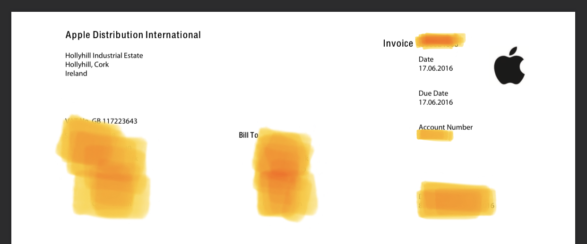
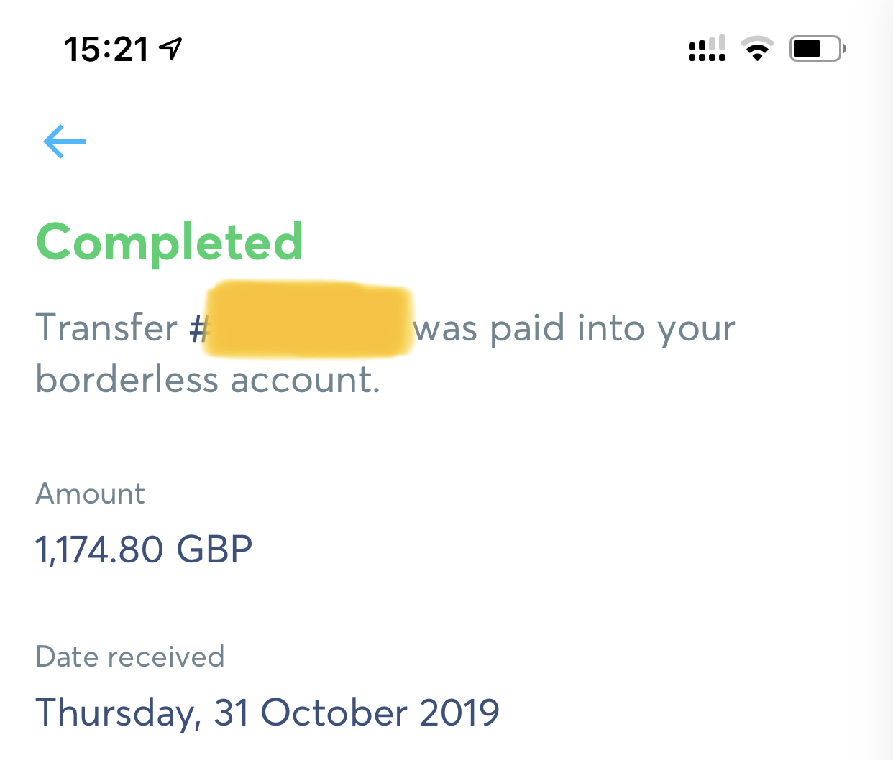

I recently got a faulty 2016 12" Macbook refunded by making an EU consumer law
claim. I've done this [once
before](/posts/2016-06-24-getting-a-full-refund-for-a-faulty-macbook-under-uk-consumer-law/)
in 2016; now more familiar with the process I thought I'd write up round two.

## TL;DR

This isn't a short process so here's the summary.

If you have a Macbook on [this list](https://support.apple.com/en-gb/keyboard-service-program-for-mac-notebooks)
and you have a faulty keyboard, you can get a refund under EU consumer law.

You must have the original invoice. Order confirmations are not good enough,
invoices look like this and are sent as a PDF once an order is completed.

1. Get it verified as having a faulty keyboard and get the laptop back
   **unrepaired**.  The company needs to be an ASP (Apple Service Provider), it
   can even be Apple Retail *iif* you bought your laptop from a non-Apple
   company - it cannot be where you bought it from.
2. Contact Apple support if you purchased online or visit a store if you bought
   it in _any_ store (Apple Retail counts as the same entity here). Ask to start
   the EU claims process _for refund_ of a device under a repair program.
3. Follow their guidance but, send them the laptop.
4. Give bank deets
5. Profit?

## My timeline

This is the exact sequence of steps I completed.

**14th June 2016**

Bought my Macbook with the money from [my last EU consumer law claim](/posts/2016-06-24-getting-a-full-refund-for-a-faulty-macbook-under-uk-consumer-law/) from the Apple Online Store.

**Sometime in 2017**

Had the keyboard replaced. (Note, this is not an essential step to get a refund)

**11th August 2019**

Laptop deposited at [Stormfront](https://www.stormfront.co.uk/) Inverness.

Just ask for a diagnosis only, they charge some money for this service - I paid
£50. I think Apple can refund you for this too but I forgot to ask for it -
oops.

Make it really clear the laptop isn't to be repaired and that you are buying a
sheet of paper that says the device has a faulty keyboard - no more. This is
quite an unusual request so make it very clear.

**15th August**

I had all the paperwork describing the fault and my laptop returned. I had
originally hoped that Apple could work with Stormfront to have the laptop
collected but they needed the charger so it was easier to have it returned.

**20th August**

Began the EU claims procedure. Provided my invoice and told I'd hear back within
a week.

**22nd August**

I have another call and provide the repair notes. They called at 2am but I
didn't answer so we spoke later in the day instead.

I had to speak to customer relations before they understood that this was to be
a refund rather than a repair. When you get to customer relations you know
you're in the right place and these folks are actually pretty great in my
experience. (Customer support != customer relations)

**23rd August**

Talked about setting up of TNT collection

**28th August**

TNT collection set up, advised they'd call to arrange the collection.

**30th August**

TNT called, collection set for 6th of September

**6th September**

TNT arrived to collect but had no proof of collection. This meant we were unable
to complete the collection on this day.

On a call to TNT, we made arrangements to deposit the packaged laptop at the
depot.

**10th September**

Laptop dispatched and proof of sending given. This was sent to Apple via email
to customer relations.

**12th September**

Lacey (my CR rep) called to take my bank details (while I happened to be in Japan!).

I provided my Revolut details via email.

**16th September**

Lacey confirmed receipt of the bank details.

Apple need to have an IBAN number. This is not something available at Monzo
where I have my current account. Sadly, Revolut dropped the ball, see below...

**24th September**

Laura called while Lacey was on holiday. Payment sent for processing.

**30th September**

Lacey called to check if the money had arrived. It hadn't and she was to follow
up with the finance team.

**2nd October**

Another CR rep called to confirm my bank details.

**10th October**

Lacey called to say the payment had been reprocessed. Advised to wait 10
business days.

**15th October**

Lacey called to check if the payment had been received. It sadly had not.

**21st October**

10 days were up. Lacey called to check, action to follow up with accounts.

**23rd October**

Finance acknowledge the request to look into it. Expected to respond within 3
days.

I asked for a goodwill gesture due to the delay and was refused one.

**25th October**

Lacey called me to confirm that the payment had been rejected by Revolut.
Revolut never told me anything...

I sent my TransferWise details instead.

**29th October**

Call from Lacey to confirm that the new details had been submitted. Scheduled a
call back for the 12th to check.

**31st October**

Received the payment in my TransferWise account. Woop. Just in time for what
might have been Brexit - which might have impacted my rights to refund here?
(who knows...)

Emailed Lacey to request the case be closed, say thanks, good bye etc.

**2nd November**

Completed Apple feedback form suggesting better communication between customer
relations - as well as good feedback for Lacey and the process.

## Lessons Learned

Do

* ...keep notes of call dates and what was agreed

Don't

* ...try and get the repair centre to liaise with Apple when sending back the
  laptop (didn't realise the charger was required)
* ...use Revolut
* ...buy a butterfly keyboard Macbook and expect it to last more than 18 months

## Phew...

This was a pretty painful process but mostly better than the last time. I had a
very good experience with the customer relations team. Having a single rep for
your case is a huge help.

I bought myself an iPhone with the proceeds this time. Phones are expensive
now...

Please contact me if you would like any more details, reference numbers etc.
[me@charlieegan3.com](mailto:me@charlieegan3.com)
