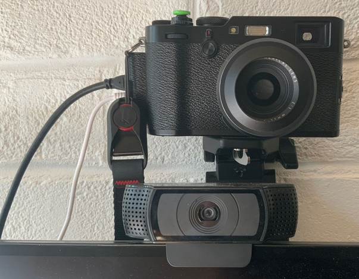

- This week after work I’ve been doing a bit of side project house keeping. I’ve mostly been automating backups of my Notion and Dropbox data using GitHub actions. I’ve also automated my [contact export](https://charlieegan3.com/posts/2020-06-06-notion-contacts-list/) from Notion. While we wait for Notion to release a public API, the private API seems to be relatively easy to use for such tasks. GitHub actions isn’t perfect but it’s free and it sends me emails when things break.
- My ‘main’ side project at the moment is some kind of ‘queryable overlay’ populated on data in my Dropbox. The idea is to be able to search for photos based on their location and other EXIF data - as well as perhaps eventually faces and other smarts. I’m interested to know what my highest altitude photo is, for example.
- At [work](https://preflight.jetstack.io/) I’ve been trying to understand how to represent severity of warnings raised about clusters and things running in them. There are many different dimensions: security, availability considerations; how confident we are that we’re right; and how much impact the worst case scenario has.
- I also had some really valuable feedback from a senior colleague on a design proposal I'd written. I've never really had feedback on that before and found it to be really helpful. I'm planning to write the notes as a blog post.
- AFK, I’ve been for two swims at the [Parliament Hill Lido](http://parliamenthilllido.org/). Pleasantly surprised at both how close and how clean it is. I am thinking of buying a [wetsuit](https://uk.roka.com/collections/mens-wetsuits/products/mens-maverick-comp-ii-wetsuit?variant=13603914743919) however as I can’t really stay in there for more than 20 mins safely. My feeling is that it’ll only get colder...
- Last weekend someone tried to snatch my phone so I bought a cheaper backup iPhone 5SE. I was really impressed by the nearby device [quick start feature](https://support.apple.com/en-gb/HT210216). I also bought what is effectively a [£14 keyring](https://www.quadlockcase.co.uk/collections/accessories/products/phone-ring-stand?variant=31349703573619) for my Quad Lock case.
- Back at work, the video calling arms race continues and I got sucked into it this week after [someone](https://twitter.com/_jsfuentes?s=21) sent me a link to a £6 capture card on eBay...

- I’ve booked my trains home for Christmas. Booked to visit my granny for the first time this year. And tried to book a trip to Edinburgh but LNER said not yet.
- We’ve been playing Sea of Thieves. We all find the controls infinitely frustrating and still can’t seem to beat any other ships with real players in them. That said, we still seem to enjoy it, firing people out of canons and drinking grog is fun too.

    

- On Sunday, I was meant to have a run+bike brick session but ended up [running with Luke](https://www.strava.com/activities/3987602822) so decided to [double](https://www.strava.com/activities/3985526181) [up](https://www.strava.com/activities/3985795212) on the bike while I waited 🥵
