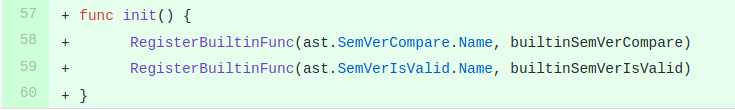

This is a post about a recent contribution I made to the OPA project. OPA (Open Policy Agent) aims to provide a standard means of authorization in the form of a policy server with a domain specific language called Rego. The project has [good documentation](https://www.openpolicyagent.org/docs/latest/) where you can read more about it.

## Why do this in the first place?

Back in May I [wrote a post](/posts/2020-05-08-semver-comparisons-with-opa/) about an experiment I'd done to see if it was possible to compare [Semantic Versions](https://semver.org/) in pure Rego. The experiment was a 'success' in that this simple task was possible - however, what I'd written wasn't particularly pretty.

I did this mostly out of interest, however I got the idea that from something I was working on with [Preflight](http://preflight.jetstack.io) at work at the time.

## Why not publish a Rego package instead?

Rego & OPA don't have the concept of a third party library or package. There is no leftpad, database wrapper, or API client that you can install and have some code available in your Rego rules. I wonder if this will come at some point, perhaps there's a good reason other than the project still being relatively young.

Instead, it would seem that the OPA community are taking a different route and including more features in the Rego language itself - which is where my changes come in.

## What was added?

Exactly what changed can be seen on [my PR here](https://github.com/open-policy-agent/opa/pull/2538).

In summary, I added two functions as built-ins to Rego. Built-ins are functions that you can call from anywhere in your Rego policies without needing to import or install. You can use any built-in that is in that version of OPA.

`semver.is_valid` allows those writing Rego policies to check that a value is a valid SemVer string. `[semver.compare](http://semver.compare)` allows the comparison of two valid SemVers.

This adds a subset of the functionality that the [coreos semver golang package](https://github.com/coreos/go-semver) implements - and it vendors this under the hood. Rego built-ins are just go functions underneath.

## What's interesting about this PR?

To most people, not a lot. The thing about this process that was most interesting to me was the decision to vendor the required functions from the coreos package to keep the dependencies on in the project low.

Patrick East, one of the OPA project's maintainers, left a [comment here](https://github.com/open-policy-agent/opa/pull/2538#pullrequestreview-448422711) explaining the reasoning.

I've never worked on a project that needed to be included in other projects as a library, this is hasn't ever really been something I've thought a great deal about as I'm usually working at a 'leaf' in the 'library dependency graph'.

So in the PR you can see we have just [copied in the package](https://github.com/open-policy-agent/opa/tree/22d4efee4d795c6a4c9345465a9771bbfbad22c9/internal/semver), and removed all but the functions we need.

This was interesting to me anyway.

## Is this being used?

Yes! I had hoped to use this to compare versions of third party installed software (prometheus, ingress-nginx etc.) but in the end, the first place this has been used is to check the version of Preflight's own agent. I think that we can use it for more in the future though and that it's a valid addition to the language.

## Final Thoughts

I started this on a 'dev-day' at work but finished it on my own time. At Jetstack we have 10 dev-days a year to use on things like this, learning and so on. I find them to be really valuable and this one was satisfying too since it represented my first 'real' contribution to a project that I've got a lot of value from.
