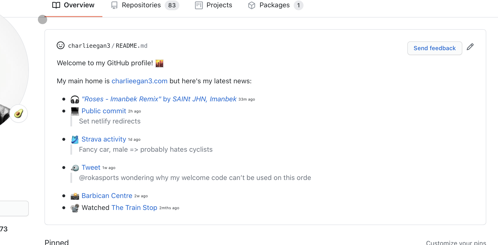

Two years ago, GitHub announced *Actions,* their repo-integrated, workflow automation product. It took me ages to get access, then when I finally did, it seemed to get a bit of a bad review for being rough around the edges. Roll on 6 months and I’m having a great time with it. This posts is a list of the fun things I’m doing with GitHub Actions - spoiler alert, not many really seem to fit the intended use case...

## charlieegan3/charlieegan3

Starting out with the most self-centered & self-promoting entry in the list is my repo that updates [my own GitHub profile](https://github.com/charlieegan3).  At the time of writing, it looks like this:



This section of the page shows the readme of the [charlieegan3/charlieegan3 repo](https://github.com/charlieegan3/charlieegan3). In that repo I have a [script](https://github.com/charlieegan3/charlieegan3/blob/fa92f0cbfacf6820873b699d7a5bdf9e355b05bf/hack/update_readme.rb) that gets this information from my website and replicates it here. It also has a little emoji for the city at the time of day it’s meant to be for me here in London. This little project was my GitHub Actions gateway drug!

Sadly it’s not especially easy to replicate, mostly that script just processes [the data](https://charlieegan3.github.io/json-charlieegan3/build/status.json) that’s updated by another, older project called [json-charlieegan3](https://github.com/charlieegan3/json-charlieegan3). Which leads me on to...

## json-charlieegan3

This project is older than GitHub Actions, but now runs there too. It’s long been responsible for updating this little ‘live’ section on my site. It’s run in all kinds of places before, from Heroku to GKE to my Raspberry Pi cluster to... 🥁 GitHub Actions!


This one makes use of git/GitHub as the storage too and shares the generated JSON file via GitHub pages with [charlieegan3.com](http://charlieegan3.com). Committing and pushing from Actions is pretty nice as you don’t need to configure the access to the repo, just update the files and commit the result back. This works in the same way as charlieegan3/charlieegan3 for the profile README update.

## personal-website

My personal website is now, once again, back on GitHub. I use actions to build the site with [Hugo](https://gohugo.io/) and to commit the result to a `netlify` branch. This is then picked up and deployed to Netlify. I don’t use pages for my personal site to keep [charlieegan3.github.io](http://charlieegan3.github.io) simple and my other Pages sites working.

This is pretty boring, everyone and their mum has a Hugo site these days... what makes this interesting?

So glad you asked. I’ve also got a script that can import page content and posts from [Notion](https://notion.so). I [make use of the export functionality](https://github.com/charlieegan3/personal-website/blob/master/bin/export_notion.rb) to get a zip of the page called ‘*Website*’ and all it’s children pages. Using this data, I then have a script to [import](https://github.com/charlieegan3/personal-website/blob/master/bin/import_notion.rb) this into the existing Hugo site.

This is all a bit of a hack, but it seems to work really nicely. This post is the second to be written using Notion as the ‘CMS’ (Content Management System). What’s nice about using Notion for me is that it takes the friction out of writing on my iPad. I can import images and format the post easily.

To actually update the repo, I make use of this little known(?) GitHub Actions feature called `workflow_dispatch`. It looks a bit like this:

```yaml
on:
  workflow_dispatch:
    inputs:
      commitSubject:
        description: Subject
        required: true
      commitDetail:
        description: Detail
        required: false
```

These two fields allow me to set the commit message Subject and detail. GitHub uses this to generate the form like this:


Then when I click `Run workflow` I get my site updated from Notion with a nice commit message explaining what’s been added.

At work we once had lunch with a professional blogger. One of the things he explained was important was reducing the friction to update and create content. This seemed so simple, and I’ve taken it to heart. Before last weekend, I didn’t have the path from WYSIWYG → published site properly automated, now I do and this is my second post in 2 weeks. Not committing to that schedule, but it’s just an interesting change for me.

## notion-export & dropbox-backup

You won’t find these repos on my profile as I’m keen to keep the GitHub Actions run state and logs private. I’ve not yet worked out who can see what in the logs on public repos.

These repos don’t use Actions for anything related to git or GitHub, they just run jobs on a schedule.

**notion-export** downloads a full copy of my Notion workspace and uploads it to Dropbox.

Exporting the data is much the same as it is to [get the data for the website](https://github.com/charlieegan3/personal-website/blob/f5c916ffc598693de1dd789a03f16869f330706f/bin/export_notion.rb). The upload is super simple too with the `[dropbox_api`gem](https://github.com/Jesus/dropbox_api). I find Dropbox’s API access story to be so much better than Google Drive and all the others. Dropbox isn’t without faults, but it does seem to be the most user friendly cloud storage as a one-man-band user trying to organise and automate the dull stuff.

```ruby
require "dropbox_api"

ts = Time.now.utc.strftime("%Y-%m-%d")

client = DropboxApi::Client.new(ENV.fetch("DROPBOX_TOKEN"))
File.open("export.zip") do |f|
  client.upload_by_chunks(
    "/Archive/Account Exports/notion-#{ts}.zip",
    f,
    {
      mode: "overwrite"
    }
  )
end
```

**dropbox-backup** might be a rather unexpected project. I don’t know anyone else that backs up their personal cloud storage. My school computing teacher said that computers allow you to make mistakes very quickly, I’m sure that’s not original, but it stuck with me. I make reasonably heavy use of automation and bulk update tools like [Rclone](http://rclone.org/) to manage my Dropbox and since it contains things like the only digital copy of photos going back as far as 1950, paying BackBlaze £2 a month for some space in b2 felt worth it.

This repo contains only the GitHub Actions manifest really:

```yaml
on:
  schedule:
  - cron: '0 1 1,15 * *'
jobs:
  build:
    runs-on: ubuntu-latest
    steps:
    - uses: actions/checkout@v2
      with:
        fetch-depth: 0
    - name: Install rclone
      run: |
        curl https://rclone.org/install.sh | sudo bash
    - name: Run sync
      shell: bash
      env:
        RCLONE_CONFIG: ${{ secrets.RCLONE_CONFIG }}
      run: |
        set -ex
        echo $RCLONE_CONFIG | base64 -d > rclone.conf
        rclone \
          --config rclone.conf \
          sync \
          "dropbox:/" \
          "bb:bucket-name/" \
          --exclude "Vault/**"
```

Here we see a really clear example of Actions as ‘cron-as-a-service’, and I suppose a secret store too for Rclone config.

## photos & music

My two ‘flagship’ (lol) projects are my [Instagram-driven & enhanced photo library](https://github.com/charlieegan3/photos) and my [musical memory crutch](https://github.com/charlieegan3/music). Both these projects refresh their data using GitHub actions.

**photos** downloads new post data, downloads missing locations, and then stores the media from the post in object storage. It then commits the updated data files which kicks off another action to build the site and push it to the `netlify` branch. Seems like a pretty good fit, but I need to make the requests to Instagram via my residential proxy these days. The GitHub IPs appear to be unable to make the same requests...

**music** does quite [a lot more](https://github.com/charlieegan3/music/tree/master/.github/workflows)... in summary, the following tasks are all running in Actions:

- Data refresh (download play data and store in BigQuery)
    - Spotify
    - Shazam
    - Soundcloud
    - YouTube
- Summarization (save the results of a query to object storage for the website to consume)
    - Home page overview (plays by month, top tracks and artists per year)
    - Recent plays
    - Top monthly plays
    - Tracks per artist to generate search index
- ‘Enriching’ data. Operations to complete missing data and consolidate a number of consistencies. Saving the result back to another BigQuery table.
- Generating the artist pages and updating the Hugo site at [music.charlieegan3.com](http://music.charlieegan3.com)
- Backing up the play data to GCS (in case I screw it up, which has happened before)
- Monitoring probe to test for missing data and send alerts

I was hoping that this final example would show that GitHub Actions can be the glue to tie together git, object storage, external services and static sites into something that looks like an ‘application’.

---

So that’s how I’m using GitHub actions, as of today.

I plan to use it more since it’s free and seems to be pretty reliable.

**Why not use k8s?** Can’t really be bothered maintaining things that I want to ‘just-work’ on my pi cluster that sometimes gets dripped on and breaks. My new rule is if it’s used by anyone other than me, then I run it on someone else’s cloud - not the little one in my house, GitHub Actions has been a big part of that shift.

**Why not run these on [insert cloud here]?** Actions is free, and integrated with git.

**Why not use [insert other free cron tool]?** I probably haven’t heard of it and it doesn’t integrate as nicely with git.
