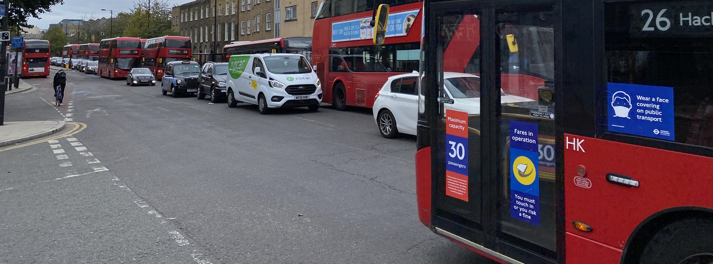

- I've been working quite a lot on my [linux-environment](https://github.com/charlieegan3/linux-environment) project. This is my latest project and has become an Ansible playbook to configure a system based on Fedora Workstation. This project is meant to replace the following older projects:
    - [dotfiles](https://github.com/charlieegan3/dotfiles) - the repo I originally created to manage my evolving vim config after my 2015 internship that I used until the beginning of this year.
    - [dev-machine](https://github.com/charlieegan3/dev-machine) - a lockdown project to reliably build a cloud virtual machine for development use.
    - [dev-desktop](https://github.com/charlieegan3/dev-desktop) (archived) - an experiment that proved unfruitful to build immutable images for use on Linux-based desktops and laptops that I use.
    The idea is that all changes are committed into the playbook and tasks and can be tested against a cloud Fedora VM to ensure they're still valid for a newly imaged system. This way I can continue to use the system without regularly needing to reinstall. I am particularly proud that I've found a way to share my screen in Zoom and share a window in Firefox or Chrome if need be too (using xwayland).
    I still need to find a good system for syncing (probably manually) .envrc files and other secrets to new machines. This will probably be some hack involving the [bitwarden/cli](https://github.com/bitwarden/cli).
- This week at work has sea-sawed between being guided by the adage "What would Rails do?" and wondering "Why not Rails again?" I've built a layer to allow our application to talk to a database, I think this is well designed now. I also spent significant time implementing things in React&Redux that would have been quicker with server side rendering and progressive enhancement - or in Vue.js. I still don't believe Redux is an ergonomic way to build frontend applications and find it to be a major pain to be honest.
- 4 years after I first wanted to, I switched my default iOS browser to Firefox. Only to find that it [doesn't work as well I'd like](https://github.com/mozilla-mobile/firefox-ios/issues/7349).
- I said goodbye to the late-summer heatwave and the summer as a whole with a final BBQ. Beyond meat no pictured.
    
- I experienced the privilege of being a renter while I waited outside in the pouring rain to allow multiple happy couples look round my house. Some didn't realise that there was only a train line, no garden at the back.
    
- I won my first game of Call of Duty Warzone. I didn't kill anyone, did **100 points** of damage though so watch out. Here I am in the credits screen with a gun I stole from another player I didn't even kill.
    
- I hauled a suitcase of my flatmates stuff eastwards and got lunch at a [place](https://www.loveshackldn.com/) which sold mushroom drinks bought for me in return. I did not have any of the mushroom drinks.
- If you're reading this while waiting for a bus, it's probably here.
    
