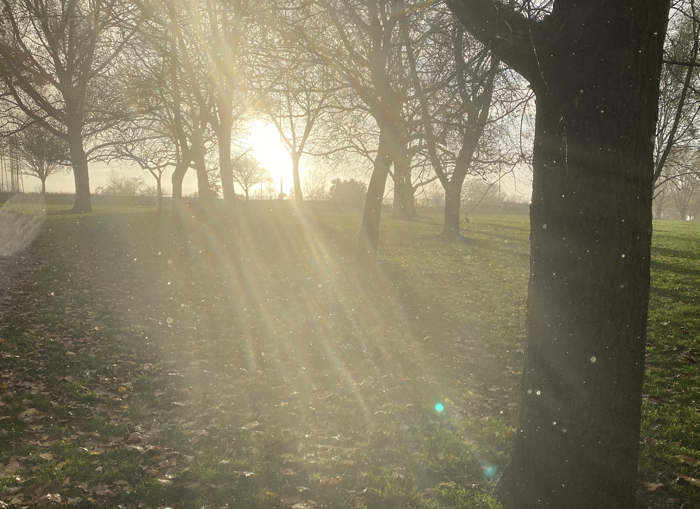
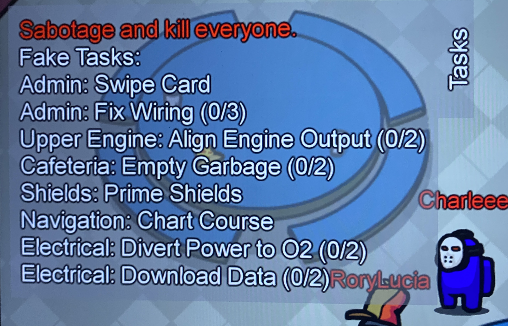

- I seem to be getting worse at writing my week notes. The last lockdown had me doing lots of projects, this one is darker and more boring.
- I’ve been working on the outline for a process by which we make decisions about our processes and policies at work. It’s a challenge and it’s uncharted territory for me as well and an interesting parallel to a technical design I’m also working on.
- On Monday I had a dev-day to investigate [CUE](https://cuelang.org/). I was interested in the language as an alternative to OPA’s Rego for checking constraints on linked JSON objects. The verdict for my use case was that it’s not really there yet. I found that the type imports for k8s objects were hard to reuse since my loaded JSON of the same types wasn’t loaded into a compatible format. I also found that some of the type pattern matching features weren’t really working yet. It seems interesting, but I’d say more comparable to [Jsonnet](https://jsonnet.org/) than Rego.
- I did take this photo in *Finsbury Park* today though. I went to meet a friend for a run and got caught in a rather special downpour. The more polished version of this moment is [here](https://www.instagram.com/p/CHq2fgXg6sc/). I left this one here since you can see the rain drops.
    
- This week has been quite game heavy, Warzone, Deep Rock Galactic, Codenames, Zwift?! and... Among Us again. I’m ever so slowly teaching myself to blatantly lie to my friends. Even taking a note of my fake tasks to regurgitate in the emergency meetings!
    
- I need to get back to watching The Crown.
