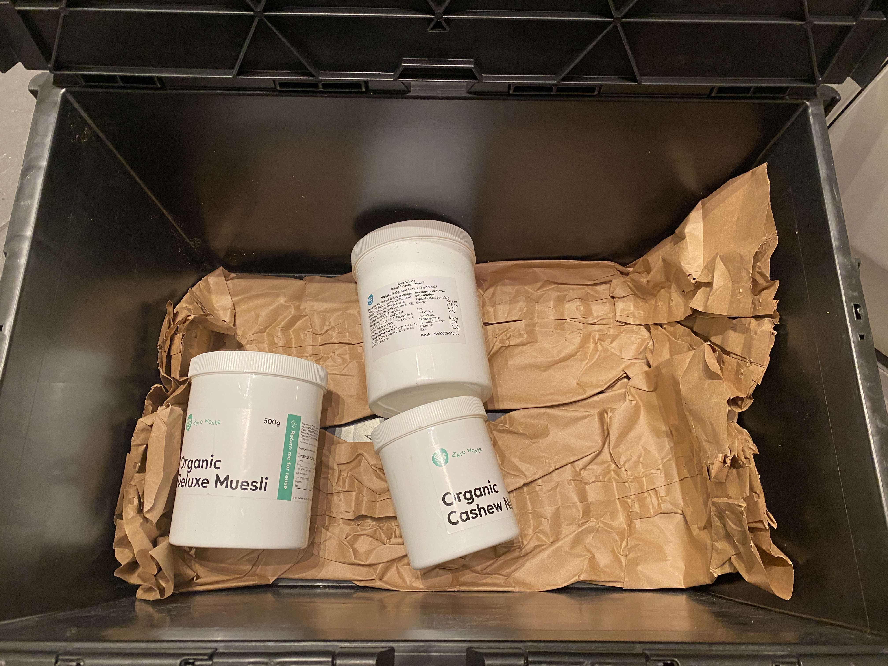

- I've been working my way through every single Spotify *2020 Unwrapped* playlist I can get my headphones on! It's exciting as it's the one chance in the year to break the filter bubble Spotify puts one in - or at least get a highlight reel of someone else's filter bubble.
- My fall recovery has dragged on into week two. I'm not sure if there's a name for the frustration of not being able to exercise while wanting to exercise more than ever. I've been making up for it by watching cycling documentaries. Finally watched *[Stop at Nothing](https://www.imdb.com/title/tt3511812/).* I should have watched it years ago, Armstrong's tour wins happened around the same time as our family cycling holidays in Ireland. 11 year old me had no idea. I also watched *[Pantani: The Accidental Death of a Cyclist](https://en.wikipedia.org/wiki/Pantani:_The_Accidental_Death_of_a_Cyclist).*
- The company that bought our company was mostly [bought](https://finance.yahoo.com/news/thoma-bravo-announces-strategic-growth-130000251.html) by another company. We're all still working out what this means for us! Something for the new year I guess.
- At work I've built this fun graph processing functionality for Kubernetes objects which I'm pretty happy with. It's going to back a new dashboard in our SaaS product.
- Fed up of cycling my trainer in my underwear I went for a [real bike ride](https://www.strava.com/activities/4463246063) - some hill reps on Highgate Hill. I felt pretty nervous going any speed at all downhill, and I didn't even fall off on a hill.
- Getting my [Good Club](https://goodclub.co.uk/j/charlieeq73w6) order with some reusable packaging felt like a bit of a breakthrough moment. Mum and Dad would be proud.
    
