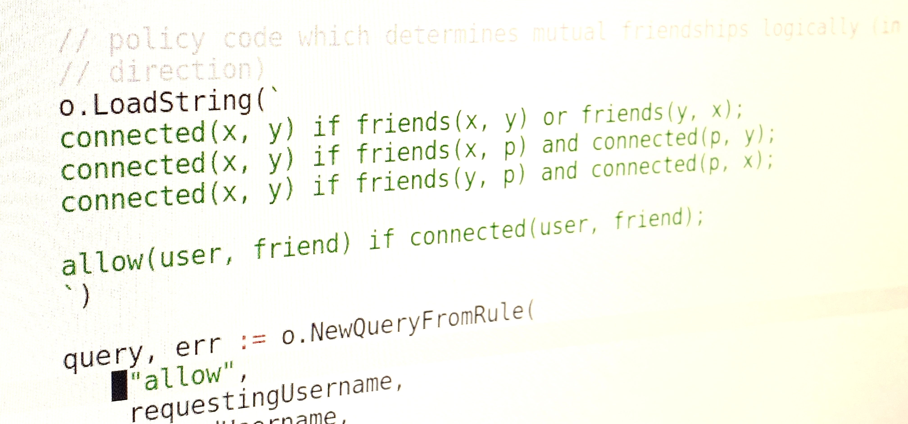

Over the past 18 months I've becoming increasingly interested in the idea of standardizing authorization checks in software. This interest started when using [Open Policy Agent](https://www.openpolicyagent.org/) (OPA) as an admission controller for Kubernetes environments at work two years ago. I've since used OPA's policy domain specific language (DSL) [Rego](https://www.openpolicyagent.org/docs/latest/policy-language/) extensively within a Go application as part of [Jetstack Secure](https://www.jetstack.io/blog/jetstack-secure/).

We are using Rego to perform policy evaluation on Kubernetes resource data - rather than in the context of authorizing requests, the subject of this post and an area I'm interested in exploring.

I've since learned about [Polar](https://docs.osohq.com/go/getting-started/policies.html), another authorization DSL from [Oso](https://www.osohq.com/), and [CUE](https://cuelang.org/) which can both be [embedded](https://pkg.go.dev/github.com/osohq/go-oso) in a Go application like Rego. I thought it would be interesting to compare them with a simple application and fictional application with some example authz requirements.

## Example 1: *Don't touch my stuff!*

For our first example, Alice and Bob each have a number of secret journal entries and should only be able to request their own from the `/entries/{id}` endpoint.

**[Golang Handler](https://github.com/charlieegan3/logic-authz-dsl-playground/blob/main/internal/handlers/golang/get_entry.go)**

First for comparison we have a simple implementation in Go where we load have a map of users and entries and process the request using the data from each. We only return ok if there's a matching entry for the ID and the user of that entry is the same as the requesting user.

```go
// we're using a bearer token, we have a helper to look up the user
// from using the data in the headers
userName, responseCode := helpers.AuthnUser(&r.Header, users)
if responseCode > 0 {
    w.WriteHeader(responseCode)
    return
}

// get the entryID from the request vars set for us by go mux
entryID, ok := mux.Vars(r)["entryID"]
if !ok {
    w.WriteHeader(http.StatusBadRequest)
    return
}

// check that the entry exists
entry, ok := (*entries)[entryID]
if !ok {
    w.WriteHeader(http.StatusNotFound)
    return
}

// check that the existing entry has the same name as the current user
if entry.User != userName {
    w.WriteHeader(http.StatusUnauthorized)
    return
}
```

We can see that the Go implementation is pretty simple in isolation.

**[Rego Hander](https://github.com/charlieegan3/logic-authz-dsl-playground/blob/main/internal/handlers/rego/get_entry.go)**

Next we have a handler with the same functionality, but which uses Rego for the same check. The important part is really this bit, the Rego code. Everything else here is (rather a lot of) boilerplate needed to integrate with the OPA package and extract the results of the evaluation.

```ruby
package auth
allow {
    input.Entry.User == input.User
}
```

```go
// create a rule which can be partially evaluated at boot time and reused
// in each call to the handler
var getEntryRule rego.PartialResult
compiler, err := ast.CompileModules(map[string]string{
    // simple rego rule to check the data in the input conforms. i.e. that
    // the user and entry/user match
    "get_entry.rego": `
    package auth
    allow {
        input.Entry.User == input.User
    }`,
})
if err != nil {
    log.Fatalf("rule failed to compile: %s", err)
}

getEntryRule, err = rego.
    New(rego.Compiler(compiler), rego.Query("data.auth.allow")).
    PartialResult(context.Background())
if err != nil {
    log.Fatalf("failed to compute partial result: %s", err)
}

return func(w http.ResponseWriter, r *http.Request) {
    // we're using a bearer token, we have a helper to look up the user
    // from using the data in the headers
    userName, responseCode := helpers.AuthnUser(&r.Header, users)
    if responseCode > 0 {
        w.WriteHeader(responseCode)
        return
    }

    // get the entryID from the request vars set for us by go mux
    entryID, ok := mux.Vars(r)["entryID"]
    if !ok {
        w.WriteHeader(http.StatusBadRequest)
        return
    }

    // check that the entry exists
    entry, ok := (*entries)[entryID]
    if !ok {
        w.WriteHeader(http.StatusNotFound)
        return
    }

    // build the input data for the Rego evaluation containing the entry
    // and the requesting user
    authzInputData := struct {
        User  string
        Entry types.Entry
    }{
        User:  userName,
        Entry: entry,
    }

    // get the results from the rego evaluation
    resultSet, err := getEntryRule.Rego(rego.Input(authzInputData)).Eval(r.Context())
    if err != nil {
        w.WriteHeader(http.StatusInternalServerError)
        return
    }
    // if there are no 'solutions' then we can return unauthorized
    if len(resultSet) == 0 {
        w.WriteHeader(http.StatusUnauthorized)
        return
    }

    // next we convert the output into JSON. This is a bit of a hack but it
    // allows us to use gabs to extracts data from the response more in a
    // terse manner
    bytes, err := json.MarshalIndent(resultSet, "", "    ")
    if err != nil {
        w.WriteHeader(http.StatusInternalServerError)
        return
    }

    result, err := gabs.ParseJSON(bytes)
    if err != nil {
        w.WriteHeader(http.StatusInternalServerError)
        return
    }

    // use a gabs query to get the data we want and assert it's a boolean
    allowed, ok := result.Path("0.expressions.0.value").Data().(bool)
    if !ok {
        w.WriteHeader(http.StatusInternalServerError)
        return
    }

    if !allowed {
        w.WriteHeader(http.StatusUnauthorized)
        return
    }

    w.WriteHeader(http.StatusOK)
    fmt.Fprintf(w, fmt.Sprintf("%v", entry.Content))
}
```

In comparison, this Rego handler without additional abstractions over the evaluation of policies is pretty verbose. I'm not sure it's really a fair comparison since parts like the rule initialization and result parsing could be shared over many endpoints and authz rules with the right abstraction.

I liked that it was possible to partially evaluate the rule and use it again and again in each call to the handler. I was most frustrated with extracting the data from the response and opted to use [gabs](https://github.com/Jeffail/gabs) to make that easier.

**[CUE Handler](https://github.com/charlieegan3/logic-authz-dsl-playground/blob/main/internal/handlers/cue/get_entry.go)**

Below is an equivalent handler in CUE. We have a document with some references we can populate and `allowed` based on the data we set to determine the result.

```go
// config is our CUE 'policy' code
const config = `
entry: {
    User: string
}
user: string

allowed: entry.User == user
`

// we're going to share the CUE runtime between requests
var rt cue.Runtime

return func(w http.ResponseWriter, r *http.Request) {
    // we're using a bearer token, we have a helper to look up the user
    // from using the data in the headers
    userName, responseCode := helpers.AuthnUser(&r.Header, users)
    if responseCode > 0 {
        w.WriteHeader(responseCode)
        return
    }

    // get the entryID from the request vars set for us by go mux
    entryID, ok := mux.Vars(r)["entryID"]
    if !ok {
        w.WriteHeader(http.StatusBadRequest)
        return
    }

    // check that the entry exists
    entry, ok := (*entries)[entryID]
    if !ok {
        w.WriteHeader(http.StatusNotFound)
        return
    }

    // first compile the cue code to make sure it's valid
    instance, err := rt.Compile("get_entry", config)
    if err != nil {
        w.WriteHeader(http.StatusInternalServerError)
        return
    }

    // next, poplate the list of users and the headers from the request
    instance, err = instance.Fill(userName, "user")
    if err != nil {
        w.WriteHeader(http.StatusInternalServerError)
        return
    }
    instance, err = instance.Fill(entry, "entry")
    if err != nil {
        w.WriteHeader(http.StatusInternalServerError)
        return
    }

    // load the results from the instance
    allowed, err := instance.Lookup("allowed").Bool()
    if err != nil {
        fmt.Println(err)
        w.WriteHeader(http.StatusInternalServerError)
        return
    }

    if !allowed {
        w.WriteHeader(http.StatusUnauthorized)
        return
    }

    w.WriteHeader(http.StatusOK)
    fmt.Fprintf(w, fmt.Sprintf("%v", entry.Content))
}
```

While it's a little less verbose than the Rego handler, the 'policy' feels less satisfactory or flexible. However, in this case, it works ok. I quite enjoyed the `instance.Fill` functionality as a means of supplying input.

**[Polar Handler](https://github.com/charlieegan3/logic-authz-dsl-playground/blob/main/internal/handlers/polar/get_entry.go)**

Finally, we have an implementation in Polar. Where the important part is really this bit, we can see that it's very terse to express what we want:

```ruby
allow(userName, _: Entry { User: userName });
```

```go
var o oso.Oso

// configure a new Oso instance
o, _ = oso.NewOso()

// make polar aware of our application types
o.RegisterClass(reflect.TypeOf(types.Entry{}), nil)

// create a simple rule where the user and the entry name must match
o.LoadString(`allow(userName, _: Entry { User: userName });`)

return func(w http.ResponseWriter, r *http.Request) {
    // we're using a bearer token, we have a helper to look up the user
    // from using the data in the headers
    userName, responseCode := helpers.AuthnUser(&r.Header, users)
    if responseCode > 0 {
        w.WriteHeader(responseCode)
        return
    }

    // get the entryID from the request vars set for us by go mux
    entryID, ok := mux.Vars(r)["entryID"]
    if !ok {
        w.WriteHeader(http.StatusBadRequest)
        return
    }

    // check that the entry exists
    entry, ok := (*entries)[entryID]
    if !ok {
        w.WriteHeader(http.StatusNotFound)
        return
    }

    // submit the name and the entry requested to the policy
    query, err := o.NewQueryFromRule(
        "allow",
        userName,
        entry,
    )
    if err != nil {
        w.WriteHeader(http.StatusInternalServerError)
        return
    }

    results, err := query.GetAllResults()
    if err != nil {
        w.WriteHeader(http.StatusInternalServerError)
        return
    }

    // if there are no results, then the request was not allowed
    if len(results) == 0 {
        w.WriteHeader(http.StatusUnauthorized)
        return
    }

    w.WriteHeader(http.StatusOK)
    fmt.Fprintf(w, entry.Content)
}
```

I quite liked how terse the policy was. This was helped largely by being about to load in types from my Go app.

## Example 2: *Network effects*

In our toy universe, we decide to !*PIVOT!* and introduce a social element to the app. Users will be able to send friend requests - for some reason. Our rule is that you can only send a request to another user when you have a mutual friend(s).

If Alice is friends with Bob, who is friends with Charlie, who is friends with Dennis - then Alice can send a friend request to Dennis.

**[Golang Handler](https://github.com/charlieegan3/logic-authz-dsl-playground/blob/main/internal/handlers/golang/create_friend_request.go)**

This is a CS101-esque search of the social graph to find a path between the two users. I guess there's likely a shorter implementation, but this one is intended to be easy to skim. Right away, we can see this authorization check is more complex.

```go
// find path of mutual friends
var reachedFriends []string
var unexploredFriends []string
for _, existingFriend := range requestingUser.Friends {
    unexploredFriends = append(unexploredFriends, existingFriend)
}

// naive loop though all the friends aggregating potential new connections as we find them
for {
    // no more work to do, a connection was not found :(
    if len(unexploredFriends) == 0 {
        break
    }

    currentFriend := unexploredFriends[0]
    unexploredFriends = unexploredFriends[1:]
    reachedFriends = append(reachedFriends, currentFriend)

    currentFriendUser, _ := (*users)[currentFriend]
    for _, friend := range currentFriendUser.Friends {
        alreadyReached := false
        for _, reachedFriend := range reachedFriends {
            if friend == reachedFriend {
                alreadyReached = true
                break
            }
        }
        if !alreadyReached {
            unexploredFriends = append(unexploredFriends, friend)
        }

        // if the friend was found, and matches the requested friend then we allow the request
        if friend == friendUsername {
            // update the target user's list of FriendRequests
            friendUser.FriendRequests = append(friendUser.FriendRequests, requestingUsername)

            // just return 200 ok if allowed, don't bother to update the state
            // since not a real application
            w.WriteHeader(http.StatusOK)
            return
        }
    }
}
```

**[Rego Handler](https://github.com/charlieegan3/logic-authz-dsl-playground/blob/main/internal/handlers/rego/create_friend_request.go)**

At first, the Rego handler is miraculously short. However, `graph.reachable` [under the hood](https://github.com/open-policy-agent/opa/blob/27c8d75d3528dc8a04e716d5455f97ee7fb537bc/topdown/reachable.go#L21) is doing much the same as our above implementation. While it's a [good addition to the language](https://github.com/open-policy-agent/opa/issues/947), it feels like cheating in this comparison.

```ruby
package authz
user_graph[user] = friends {
  friends := input.Users[user].Friends
}
default allow = false
allow {
  friends_of_friends := graph.reachable(user_graph, {input.User})
  friends_of_friends[input.RequestedFriend]
}
```

**CUE Handler**

😳 I wasn't able to implement this in CUE

**[Polar Handler](https://github.com/charlieegan3/logic-authz-dsl-playground/blob/main/internal/handlers/polar/create_friend_request.go)**

I ran into a few issues when writing the polar handler. First, I found that I needed to generate the 'data' used in evaluation on each call should it change. This meant generating polar code in my handler. Having done that, I found that I needed to make sure my friendship pairs were only listed 'one way' to avoid cycles. I'd hoped it's be possible to do things like this:

```ruby
friends("Alice", "Charlie")
friends("Charlie", "Alice");
connected(x, y) if friends(x, y);
connected(x, y) if x != y and friends(x, p) and connected(p, y);

allow(user, friend) if connected(user, friend);
```

However, I seemed to get `RuntimeErrorStackOverflow{Msg:"Goal stack overflow! MAX_GOALS = 10000"}` when doing this and opted for the simple life in order to finish this post. This lead me to the final implementation:

```ruby
connected(x, y) if friends(x, y) or friends(y, x);
connected(x, y) if friends(x, p) and connected(p, y);
connected(x, y) if friends(y, p) and connected(p, x);
allow(user, friend) if connected(user, friend);
```

While more shorter and more self sufficient that the others, I wasn't entirely happy with it. I felt like there ought to be a way to make it even more terse and easy to read.

## Parting thoughts...

This post is really just an overview of a newbies experience of authorizing requests with these tools which are meant to help with just that. I think it'd be easy to read this and think "huh? I'll just use Go thanks", but that's not my takeaway. Here's what I think:

- It's challenging to separate the domain state from the authorization decision. Polar tries to bridge the gap, OPA makes the boundary clearer. I personally think there's value in keeping the two separate in order to make the authorization checks easier to test.
- An interesting follow up would be a comparison of how each language could be hidden behind an abstraction and reused in multiple handlers with different policies and data.
- Likely due to my personal experience, but writing the checks in Polar and CUE felt like a real brain teaser vs Go and Rego.
- Extracting results from Rego evaluation was more frustrating than the others however.
- Does this logic belong in a middleware? Or in an external service. I'm still not sure where to draw the boundaries and how to share the state needed to make decisions.

In case you missed the earlier links, all the [code is here](https://github.com/charlieegan3/logic-authz-dsl-playground). Feel free to drop me a message from my homepage or tweet at me if you have an comments/questions.
