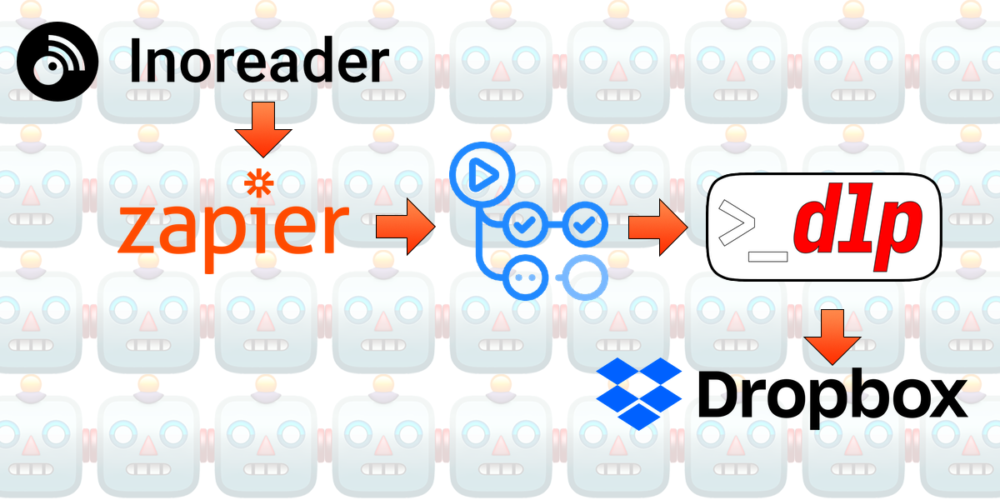
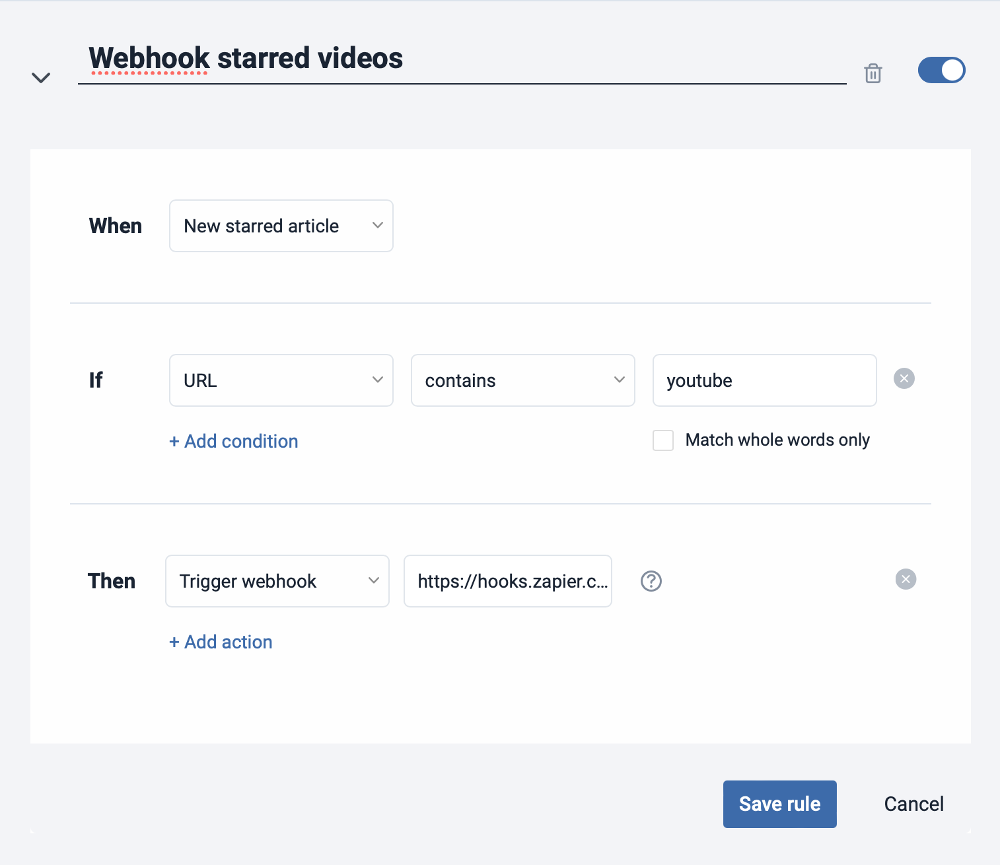
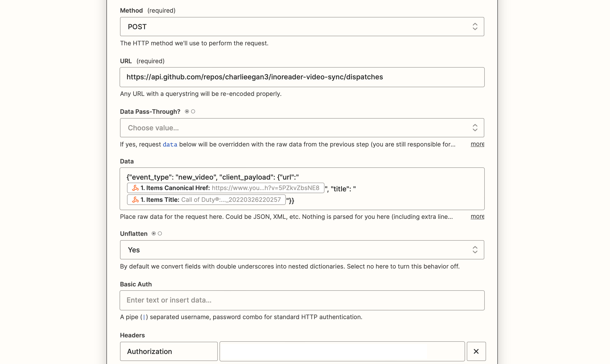
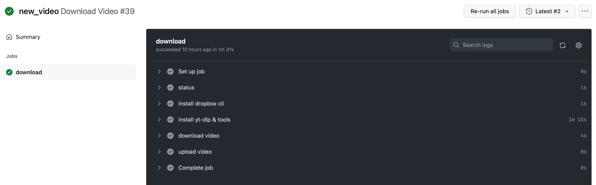

Update: Zapier webhooks are now a premium integration, however I have been able
to achieve the same thing with [pipedream.com](https://pipedream.com).



Earlier this week I was sitting on the tube (London metro) and found myself
doing something that I wish I didn't. I scrolled through the pages of installed
apps on my phone aimlessly waiting for the WiFi to connect again at the next
station[^1]. It's a waste of time as by the time the WiFi connects the train is
moving again and you're back where you started (scrolling).

[^1]: Sadly there is no 4G on most parts of the London Underground network.

I wanted to watch some videos in my watch list but couldn't and it was
frustrating. I thought about what I wanted _and_ what was low effort.

## The goal

1. Add a video to my watch list by starring it in my news reader
1. Have the video available to watch offline at some point

## Adding a video

(This needs to happen while I'm online)

I use [Inoreader](https://www.inoreader.com) to aggregate feeds for me.

Inoreader has two features relevant to this post:

1. It can follow YouTube subscriptions like RSS feeds
1. It can send webhooks when items are starred



## Triggering a download

I've gotten into the [habit](/posts/2020-09-07-github-actions-fun) of leaning
on GitHub actions when I need free, programmable compute.

There's a feature called
[`repository_dispatch`](https://docs.github.com/en/actions/using-workflows/events-that-trigger-workflows#repository_dispatch)
which I've not used before. `repository_dispatch` is a way of triggering a
workflow from a webhook. These webhooks need to be of a particular format but
can contain arbitrary data in the `client_payload` object.

Sadly Inoreader can't change the format of its webhooks, so we needed something
to change the format of these in flight and forward them on to GitHub in the
required format.

Enter [Zapier](https://zapier.com). Zapier is able to accept webhooks and send
'Custom Requests' using the data from the inbound hook. I'm not starring 100s
of videos a month so this fits in my quota fine.

`Catch Hook` is the trigger, this will give you an endpoint that looks like:
`https://hooks.zapier.com/hooks/catch/xxxxx/xxxxxxx/`. Point Inoreader at that.

Next you need a `Custom Request` Action to format the request and send it on to
GitHub. It looks a bit like this:



The `Authorization` Header needs to be set to `Bearer $PAT` where the PAT is a
GitHub personal access token with permissions to trigger workflows.

## Downloading a video

This is the easy bit. Now we're into config as code land. You can download a
video like this in GitHub actions:

```yaml
name: Download Video

on:
  repository_dispatch:

jobs:
  download:
    if: github.event.action == 'new_video'
    runs-on: ubuntu-latest

    steps:
    - name: install yt-dlp & tools
      run: |
        sudo apt-get update -y
        sudo apt-get install -y python3-pip ffmpeg
        pip3 install yt-dlp

    - name: download video
      env:
        VIDEO_URL: ${{ github.event.client_payload.url }}
        VIDEO_TITLE: ${{ github.event.client_payload.title }}
      run: |
        yt-dlp -v -f mp4 "$VIDEO_URL" -o "$VIDEO_TITLE.mp4"
```

This is great and all, but now we need to put this video somewhere we can watch
it offline...

## Stashing for later

I use Dropbox as my cloud storage of choice. It has a great API and behaves
mostly like a file system. I'm going to make use of the Dropbox mobile app for
offline viewing.

All I need to do that is to get the videos into a specific offline folder
synced to my phone. With some minor extensions to the action, we can do it like
this using [dbxcli](https://github.com/dropbox/dbxcli)[^2].

[^2]: Note `DROPBOX_CLI_AUTH_JSON` coming from the secrets. I logged in locally
  and stashed this in my repo's secrets.

```yaml
name: Download Video

on:
  repository_dispatch:

jobs:
  download:
    if: github.event.action == 'new_video'
    runs-on: ubuntu-latest

    steps:
    - name: status
      env:
        VIDEO_URL: ${{ github.event.client_payload.url }}
        VIDEO_TITLE: ${{ github.event.client_payload.title }}
      run: |
        echo $VIDEO_URL
        echo $VIDEO_TITLE

    - name: install dropbox cli
      env:
        DROPBOX_CLI_AUTH_JSON: ${{ secrets.DROPBOX_CLI_AUTH_JSON }}
      run: |
        mkdir -p ~/.config/dbxcli/
        echo "$DROPBOX_CLI_AUTH_JSON" | base64 -d > ~/.config/dbxcli/auth.json
        curl -LO https://github.com/dropbox/dbxcli/releases/download/v3.0.0/dbxcli-linux-amd64
        chmod +x dbxcli-linux-amd64
        mv dbxcli-linux-amd64 dbxcli

    - name: install yt-dlp & tools
      run: |
        sudo apt-get update -y
        sudo apt-get install -y python3-pip ffmpeg
        pip3 install yt-dlp

    - name: download video
      env:
        VIDEO_URL: ${{ github.event.client_payload.url }}
        VIDEO_TITLE: ${{ github.event.client_payload.title }}
      run: |
        yt-dlp -v -f mp4 "$VIDEO_URL" -o "$VIDEO_TITLE.mp4"

    - name: upload video
      env:
        VIDEO_TITLE: ${{ github.event.client_payload.title }}
      run: |
        ./dbxcli put "$VIDEO_TITLE.mp4" "/Apps/video-sync/$VIDEO_TITLE.mp4"
```

Now when you send a webhook, this will trigger a download and upload of that
video.



Note, if you wanted to have a manual trigger you could do something like this
instead of `repository_dispatch`:

```
on:
  workflow_dispatch:
    inputs:
      title:
        required: true
        description: Title of the video
        type: string
      url:
        description: URL of the video
        required: true
        type: string
```

The variables will be available under inputs, rather than events. Like this:
`${{ github.event.inputs.url }}`.

## Profit (watching offline)

I cheated here and just found an app that supported this out of the box.
It's fun that Dropbox's iOS client even supports the pop out player.


