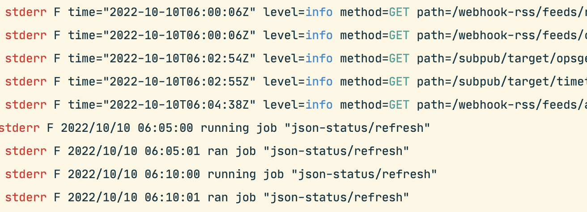

I'm fortunate to have both the time and energy to work on technical side projects in
my spare time. I feel joy when I automate something tedious or make something new possible
for my single customer (me!). Life is good, but I'm hooked and want more side project
goodness.

With all that's been going on with [Heroku](https://www.theregister.com/2022/05/04/heroku_security_communication_dubbed_complete/),
I took stock of my personal technical side project debt.
I had Heroku Dynos, [Zapier](https://zapier.com) Zaps, GitHub Actions workflows and random bits of AWS and GCP up to my neck.
I was drowning in side projects built with the wrong priorities: speed and free tier utilisation.
I'd built config loading, database initialization/migration, web servers, cron jobs & object storage
wrappers many times over and in various ways.
It was all a bit of a mess.

I've worked on a infrastructure [consulting team](https://www.jetstack.io/our-services/) in the past,
so it didn't take long to realise what I needed was a *platform*, a personal side project **_platform_**!

## Why build a personal side project 'platform'?

I chose to look for a better solution the following reasons:

- I could see the overlapping functionality in my small projects and wanted to share code for common functionality (think http, cron, database access and config loading)
- I needed to find a system which was consistent and cost-effective. Free tier hunting is cost-effective but eventually wasn't good for consistency.
- I wanted to make the most out of my side project time, more projects - thicker and faster.

## What do we mean by platform?

I'm using the term loosely. We're not talking about a GitOps system for deploying Kubernetes clusters for side projects.
My side project platform is smaller scale and higher trust and your typical enterprise infra platform.

However, there are similarities - platforms are about tenants sharing functionality.
In an enterprise infrastructure platform this might be monitoring, logging, networking,
ingress, backups and so on.
For my platform, I offer tenants (tools) secret config management, a database schema,
publicly accessible web endpoints and cron jobs.

My shared functionality is higher level and less isolated, but it's what I needed to get the job done.

## What's a _tool_? What's a _toolbelt_?

A toolbelt is a collection of likely unrelated tools grouped together. The toolbelt wraps up the shared functionality and exposes it to tools. The idea is that a small side-project comprises a single tool - though it may use services exposed by others.

More precisely, a tool is a go module with a publicly importable tool type which implements the `Tool`
interface below. A `Toolbelt` can have instances of `Tool`s registered on it - sharing its functionality.
Once tools have been registered, the toolbelt web server and job runner can be started.

```go
type Tool interface {
	// Name returns the name of the tool for display purposes
	Name() string

	// FeatureSet returns the features that the tool uses and indicates
	// to the tool belt how the tool should be configured
	FeatureSet() FeatureSet

	// SetConfig sets the configuration for the tool
	SetConfig(config map[string]interface{}) error

	// DatabaseMigrate runs the database migrations for the tool
	DatabaseMigrations() (*embed.FS, string, error)
	// DatabaseSet sets the database connection for the tool
	DatabaseSet(db *sql.DB)

	// HTTPPath returns the base path to use for the subrouter
	HTTPPath() string
	// HTTPAttach configures the tool's subrouter
	HTTPAttach(router *mux.Router) error

	// Jobs returns a list of jobs that the tool defines
	// and needs to have run
	Jobs() ([]Job, error)
}
```

A toolbelt is intended to be co-located a collection of side projects (tools) running together.

## Okay, but what do your tools do?

**Edit:** please see the [toolbelt README](https://github.com/charlieegan3/toolbelt#tools) for an updated list of tools - there are some new ones!

I currently have one 'platform tool' which is used by other tools.
My idea is that some tools will be used by other tools as services to further accelerate
my side project efforts with the platform.
[webhook-rss](https://github.com/charlieegan3/tool-webhook-rss) exposes endpoints to accept
new entries for RSS feeds, new feeds can be created on the fly to make it flexible.

Based on webhook-rss I have built the following tools to 'RSSify' things. These tools are:

* [tool-twitter-rss](https://github.com/charlieegan3/tool-twitter-rss) - creates a daily RSS entry containing tweets from my Twitter follows. 
* [tool-activities-rss](https://github.com/charlieegan3/tool-activities-rss) - creates a daily RSS entry for all activities posted by people I follow on a 'sports social network'. 
* [tool-airtable-contacts](https://github.com/charlieegan3/tool-airtable-contacts) - creates notifications for upcoming contact birthdays and other special events. This tool is multipurpose. It also has a job to sync my Airtable contacts database into a CardDAV endpoint - so that it can be synced to my phone.

I have also migrated another few side projects to my toolbelt format.
Previously these tools used a mess of implementations,
now they are all standardised and sharing in the platform's functionality.

* [tool-json-status](https://github.com/charlieegan3/tool-json-status) - for a long time I've had a tool to build a live section about my activities on my [homepage](https://charlieegan3.com). This job has now also been migrated to run on my toolbelt and makes use of the database, cron jobs and http endpoints.
* [tool-subpub](https://github.com/charlieegan3/tool-subpub) - is a tool I created to reformat the contents of calendar integrations. This tool can be configured with HTTP endpoint targets to collect data from before performing substitutions and returning the altered response to the caller. I use this to remove cruft from generated event names mostly.
* [tool-inoreader-github-actions-trigger](https://github.com/charlieegan3/tool-inoreader-github-actions-trigger) - reformats a webhook from an [Inoreader rule](https://www.inoreader.com/blog/2019/03/introducing-a-new-rule-action-webhooks.html) and forwards is it to [GitHub Actions](https://docs.github.com/en/rest/actions/workflows#create-a-workflow-dispatch-event) to trigger a job to download a YouTube video. I wrote a post about this project [here](https://charlieegan3.com/posts/2022-07-15-creating-a-diy-offline-youtube-watch-list/) (note the old mentality of use anything free and fast!).

## Which features of the toolbelt are used by different tools?

The table below is intended to outline how different tools are using the platform's functionality. All tools need config loading, but other functionality is only used by some tools.

| Tool Name                                                                                                      | Config | Database | HTTP | Cron | Depends On                                                      |
|----------------------------------------------------------------------------------------------------------------|--------|----------|------|--------------|-----------------------------------------------------------------|
| [webhook-rss](https://github.com/charlieegan3/tool-webhook-rss)                                                | ✅      | ✅        | ✅    | ✅            |                                                                 |
| [tool-twitter-rss](https://github.com/charlieegan3/tool-twitter-rss)                                           | ✅      |          |      | ✅            | [webhook-rss](https://github.com/charlieegan3/tool-webhook-rss) |
| [tool-activities-rss](https://github.com/charlieegan3/tool-activities-rss)                                     | ✅      |          |      | ✅            | [webhook-rss](https://github.com/charlieegan3/tool-webhook-rss) |
| [tool-airtable-contacts](https://github.com/charlieegan3/tool-airtable-contacts)                               | ✅      |          |      | ✅            | [webhook-rss](https://github.com/charlieegan3/tool-webhook-rss) |
| [tool-inoreader-github-actions-trigger](https://github.com/charlieegan3/tool-inoreader-github-actions-trigger) | ✅      |          | ✅    |              |                                                                 |
| [tool-json-status](https://github.com/charlieegan3/tool-json-status)                                           | ✅      | ✅        | ✅    | ✅            |                                                                 |
| [tool-subpub](https://github.com/charlieegan3/tool-subpub)                                                     | ✅      |          | ✅    |              |                                                                 |

## How does one run a toolbelt?

The toolbelt can be used however you need. Sometimes it makes sense to have a single instance running jobs
and running a webserver. Other times it might be more suitable to run cron jobs on another instance.
My jobs are all lightweight and mostly IO bound, so I run them on the same instance as the web server -
to save some cash and make deployment extra simple.

It looks a little like this:

```go
// create a new toolbelt to register tools to
tb := tool.NewBelt()
// set the config containing config values for all tools,
// these are handed down as tools are registered
tb.SetConfig(cfg)
// set the toolbelt's database, this can be shared by
// tools which need it
tb.SetDatabase(db)

// add tool to the toolbelt
err = tb.AddTool(&example.Example{})
if err != nil {
    log.Fatalf("failed to add tool: %v", err)
}
// ... add more tools
err = tb.AddTool(&example.Example{})
if err != nil {
    log.Fatalf("failed to add tool: %v", err)
}

// start a job worker
go tb.RunJobs(ctx)

// start a web server
tb.RunServer(ctx, host, port)
```

I have a private project in my GitHub account where I define how my toolbelt looks. When I commit to that repo,
an image is built and deployed to [Northflank](https://northflank.com). I've replaced Heroku with Northflank now 
and am very happy with the platform, the service and the pricing.

In the toolbelt repo, there's an
[example here](https://github.com/charlieegan3/toolbelt/blob/main/cmd/example/main.go)
you might find useful if you'd like to run your own toolbelt.

## What's next?

I have a few ideas for future tools and functionalities.

I'd like to be able to expose a [Go Cloud Bucket](https://gocloud.dev/howto/blob/) to tools. This would allow
tools to store and retrieve blob data in some standard way with a prefixed path.

I think that it'd also be nice to offer a means for tools to spawn async jobs in an ad-hoc way. This would allow
me to run more CPU intense jobs on a separate instance when required. It'd plan to use the
[Northflank API](https://northflank.com/docs/v1/api/introduction) to enable this functionality.

Finally, I think it'd also be nice for tools to be able to register for particular hostnames. This would mean
that tools would be able to serve content on the "/" path making it useful for user-facing sites rather than 
arbitrary webhooks and RSS feeds like I have at the moment.

Other than features, I'm interested to present this project internally to get feedback on the idea. I think it's
a good model for me, and I'm interested to learn what might stop others from using it for their projects.

## Further Reading

You can find the toolbelt repo [here](https://github.com/charlieegan3/toolbelt). There are some example tools
in that repo, however you might want to check out the link in the post above for more fully-featured examples.

Feel free to tweet or email me ([see homepage](http://charlieegan3.com)) if you have any ideas, questions or feedback.
