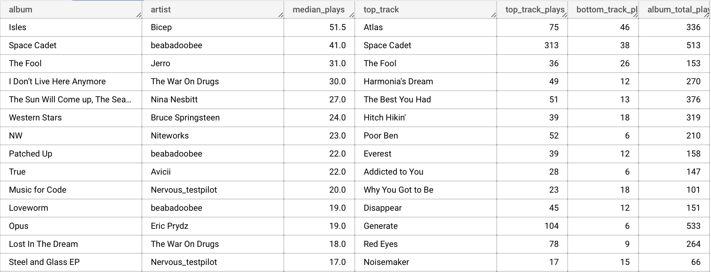

I have been a Spotify subscriber for over 10 years. I use their API and data from
[Last.fm](https://www.last.fm/user/charlieegan3) to keep a record of all my play
history.
I [store the data in BigQuery](/posts/2018-11-20-how-i-learned-to-stop-worrying-and-build-my-own-lastfm/).

Recently, I have been unhappy with Spotify's service for a number of reasons. I have also
been [unimpressed](https://stackoverflow.com/questions/73062405/are-tracks-played-on-apple-watch-logged-to-apple-musics-recently-played-resourc)
with the streaming alternatives for my use cases - which are admittedly very niche.

For the first time since I was at school, I found myself wanting to buy some music again. 
The only problem was that I didn't know what the best buys would be. I listen to playlists
and tracks in random orders and amounts, so I have a poor idea of about what my favorite
albums are.

I wanted to find albums which I have listened to a lot, but also where I'd listened to all
the tracks a good amount. Luckily I have a BigQuery table with 10 years of
play data in it.

After some fiddling, I came up with the following query:


```sql
WITH
    distinct_tracks AS (
        SELECT
            DISTINCT track,
                     album,
                     artist
        FROM
            `charlieegan3-music-001.music.enriched`
        WHERE
            album != ""),
    candidate_albums AS (
        SELECT
            album,
            artist
        FROM
            distinct_tracks
        GROUP BY
            album,
            artist
        HAVING
            COUNT(track) > 3),
    play_counts AS (
        SELECT
            COUNT(created_at) AS count,
            track,
            plays.artist AS artist,
            plays.album AS album
        FROM
            `charlieegan3-music-001.music.enriched` AS plays
            JOIN
            candidate_albums
        ON
            candidate_albums.album = plays.album
            AND candidate_albums.artist = plays.artist
        GROUP BY
            track,
            plays.artist,
            plays.album
        ORDER BY
            count DESC),
    summary_data AS (
        SELECT
            PERCENTILE_CONT(count, 0.5) OVER(PARTITION BY album, artist) AS median,
            MAX(count) OVER (PARTITION BY album, artist) AS max,
            MIN(count) OVER (PARTITION BY album, artist) AS min,
            SUM(count) OVER (PARTITION BY album, artist) AS total_plays,
            count,
            track,
            artist,
            album
        FROM
            play_counts )
SELECT
    album,
    artist,
    median AS median_plays,
    track AS top_track,
    count AS top_track_plays,
    min AS bottom_track_plays,
    total_plays AS album_total_plays
FROM
    summary_data
WHERE
    count = max
  AND min > 3
ORDER BY
    median DESC

```

Since I have no record of the actual total tracks for an album, I use `candidate_albums`
to select albums where more than three tracks have been played. I also require that the
least played track has been played more than three times.

This does a good job of filtering out albums where I have only listened to a single track
many hundreds of times. I'm happy with the list, and will probably buy a few of these to
play in [Doppler](https://brushedtype.co/doppler/).
