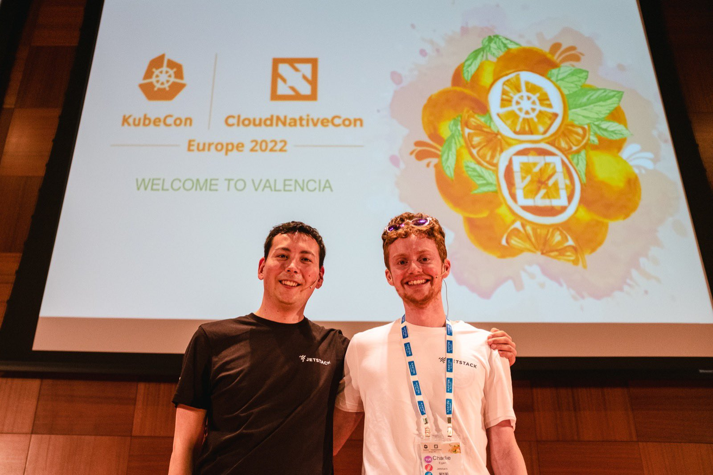

## Abstract

Within a single cloud provider, accessing secured APIs using your own workload identity is simple. Cloud SDKs used by
application developers know how to retrieve identities and credentials from the cloud environment for each workload
based on its context. A cloud administrator can then assign permissions to these identities which allow access to the
required APIs.

This is seamless for developers - simply calling an API in their code just works, while behind the scenes
the network call is cryptographically authenticated / authorized.

Unfortunately for the user, this identity is cloud-specific. With few alternatives, this often leads to long-lived
credentials being mounted into workloads instead.
This is less secure and harder to use. This presentation will show an alternative solution which combines features of
open source CNCF projects Kubernetes, cert-manager, cert-manager-csi-driver-spiffe, cert-manager-trust and
spiffe-connector to expand your SPIFFE trust domain to any cloud.

## Photos

