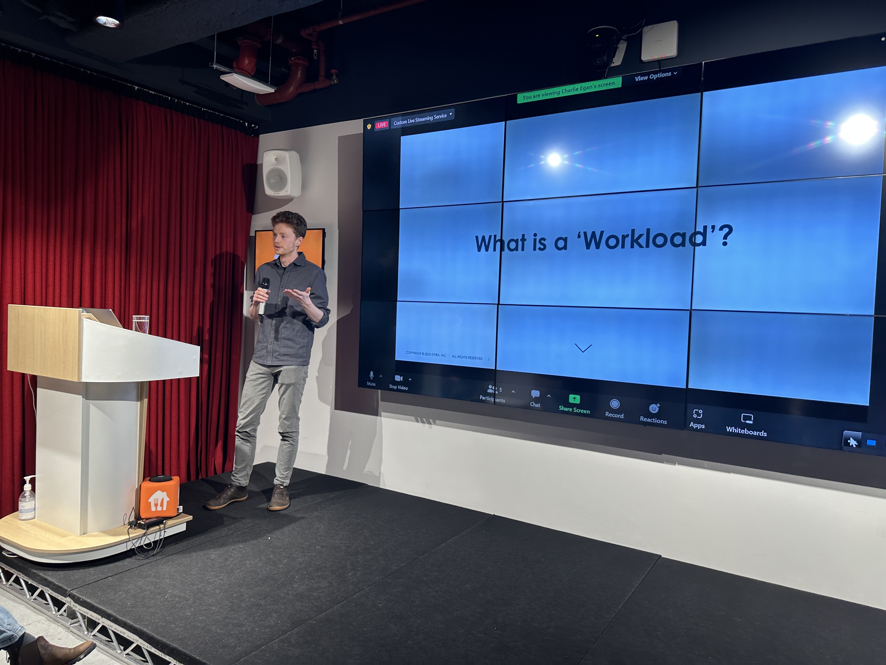
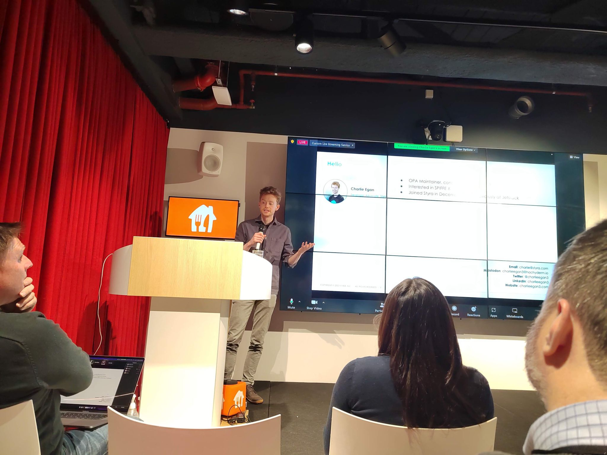

## Abstract

What’s the highest value platform feature you can offer your Kubernetes tenants? It might be standardizing workload
identity and policy controls. In this session, we will discuss desirable properties for a workload identity and present
a modern architecture built on SPIFFE and cert-manager which uses Open Policy Agent (OPA) for policy decisions. This
should leave you with actionable ideas to help you re-evaluate your workload identity functionality and security
posture.

## Links

* CNCF Tools
  * [SPIFFE](https://spiffe.io/)
  * [OPA](https://www.openpolicyagent.org/)
* [Jetstack SPIFFE Blog](https://www.jetstack.io/blog/workload-identity-with-spiffe-trust-domains/)
* Styra Products
  * https://www.styra.com/styra-das/
  * https://www.styra.com/styra-load/

## Photos

_photo credit: Greg Brown_

_photo credit: Abdullah A. Mohammed_

## QR Code

