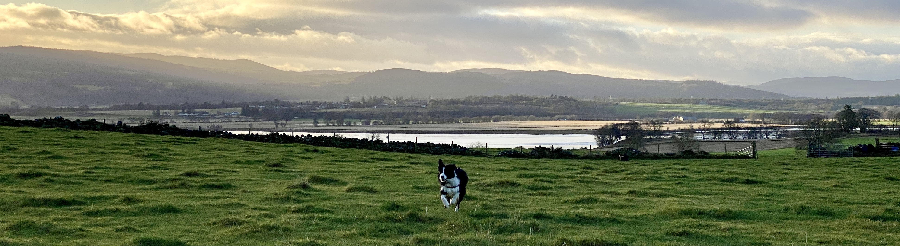

- I’m on holiday! ☃️ I’m now back at home home on the Black Isle.
- I went for a few laps of Highgate Hill and found a new route back down through the Hilldrop Estate. I hope to make this a regular route in the new year as it’s a good workout I can do without risking getting too wet as it’s close to home.
    
- My 1 week review of the Wahoo Element Roam is that the GPS takes a long time to find signal but that the live segment view is excellent. I’ve still not made much use of the navigation features.
- I’ve been reading about and playing with [beancount](https://beancount.github.io/docs/), a text-based, double entry accounting tool. I can see that it would be valuable, but am currently evaluating if I want to invest time in importing my data to a beancount-based system. Perhaps it’s a good Christmas project, perhaps I’d rather cycle my bike.
- I am very grateful to have made it out of London before tier 4 came into place. Incredibly lucky, this Christmas break is something I’ve been needing for a long time and I really feel for those unable to travel to where they wanted. What a nightmare.
- Since arriving home I’ve been cycling and playing with Alfie. Lots of nice photos...
    
    
