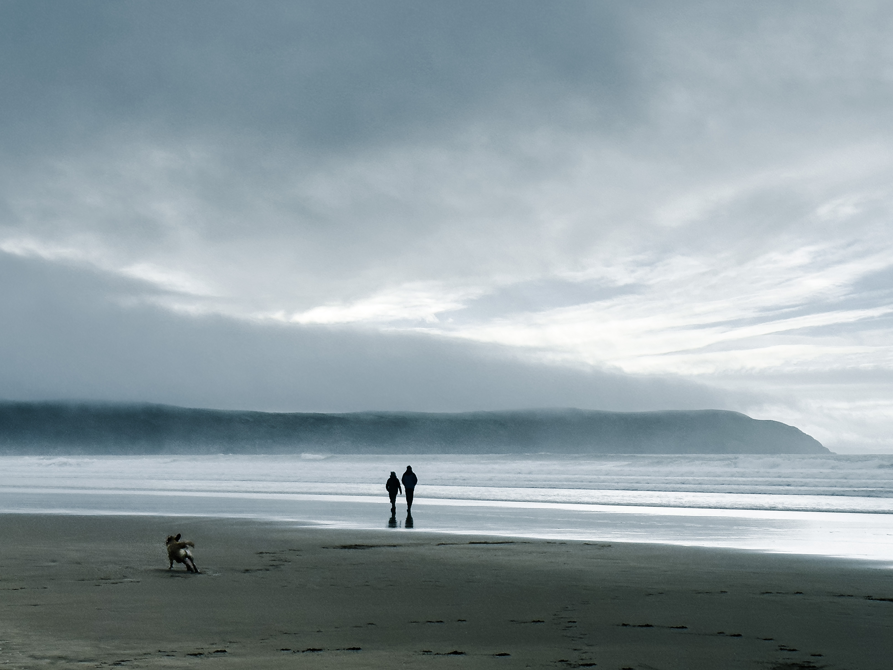
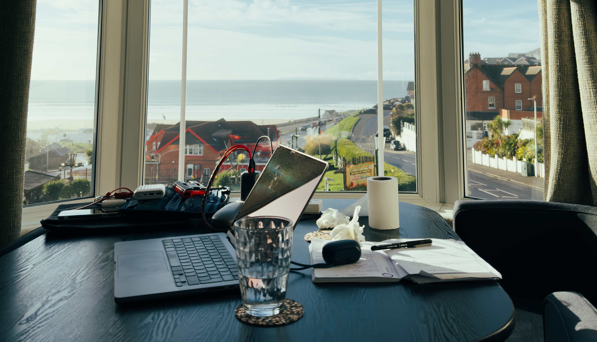

---
title: "Week 22: By the Sea"    
date: 2023-02-19 05:48:04 +0000    
---

* I'm in North Devon this week. On Wednesday I worked remotely with a view in [Woolacombe](https://en.wikipedia.org/wiki/Woolacombe) before walking to [Ilfracombe](https://en.wikipedia.org/wiki/Ilfracombe) on Thursday for another few nights. I _really_ enjoyed working with a sea view (the lunchtime walks and cafe soup was great too). This was a welcome surprise as generally I've not enjoyed working away from my endgame desk at home due to flaky internet, distractions, and poor seating. I felt very grateful for the flexibility to be able to do this trip.
  
  
* This week at work we launched [Styra Load](https://www.styra.com/styra-load/). I've been working on the documentation and self-directed performance 'test bench'. Load is based on OPA but uses a binary JSON format to achieve some solid performance gains for large datasets. If you're an OPA user, you might want to take it for a [test ride](https://www.styra.com/free-trial-14/) - let me know how the performance stacks up!
* I want to be able to go away on holiday and not worry about how much battery my toothbrush has. Mine ran out this week and it's a major pain. I was surprised after doing some research that the only toothbrush with USBC and a pressure sensor seems to cost [£300](https://www.philips.co.uk/c-e/pe/electric-toothbrushes/sonicare/prestige-9900.html#!)! A toothbrush with USBC, a pressure sensor, and small heads doesn't seem to exist yet...
* While in the area, there was an attendance at the 150th [Woolacombe Dunes Parkrun](https://www.parkrun.org.uk/woolacombedunes/results/150/) - one of the [toughest](https://outsideandactive.com/articles/the-toughest-parkrun-in-the-world-probably) in the country! Running home along the [route](https://en.wikipedia.org/wiki/Ilfracombe_branch_line#/media/File:Ilfracombe_1874_01.png) of the [Devon Belle](https://en.wikipedia.org/wiki/Devon_Belle) was a nice too. I'm in awe of this train that went from Waterloo to Ilfracombe, direct.