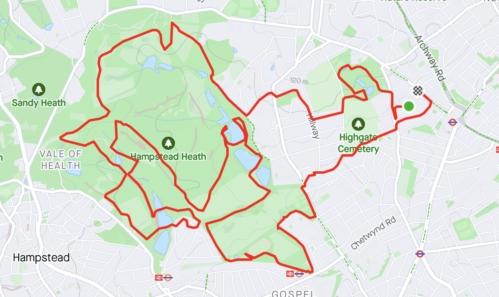
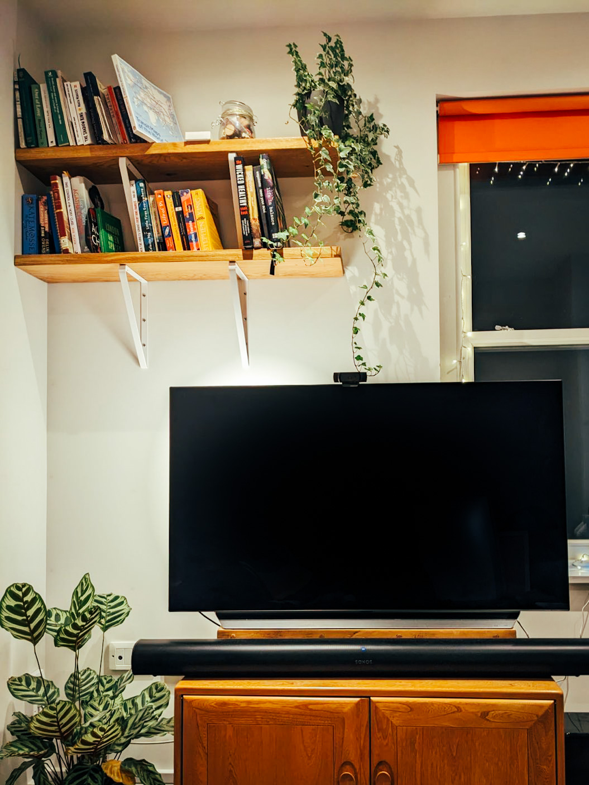

---
title: "Week 23: Long Expected DIY"    
date: 2023-02-26 05:48:04 +0000    
---

* **Enjoying outdoor mornings**. I've had my Dad visiting and we had two nice breakfasts out with coffee and pastries this week. Getting outside to start the day with a walk has been really refreshing.
* **Do what browsers do.** I've been working on an [OPA feature](https://github.com/open-policy-agent/opa/issues/5673) to support reusing cached bundles. I _really_ enjoyed reading the Mozilla [docs on HTTP Caching](https://developer.mozilla.org/en-US/docs/Web/HTTP/Caching), they're clear and easy to follow. I enjoyed the design parallels with web browsers.
* **Badminton courts are hard to come by.** I try to play once a week with some friends. Courts are only released daily at 10pm one week before, so everyone knows this and the site crashes creating a panicky checkout process for all involved. You've just got to hope no one is going for your court - except they probably are.
* **Activating crunch mode** - I had a talk accepted for Cloud Native London at the same time as the event being moved forward to [Wednesday next week](https://www.meetup.com/cloud-native-london/events/289518767). I have some OPA and SPIFFE related preparation to be doing...
* **Mastodon & Ivory.** I continue to enjoy the Mastodon bubble and the [Ivory](https://tapbots.com/ivory/) UX. Being able to follow the `#OPA` hashtag has led to some good discussions this week, it's a feature I like a lot.
* **[Burgess Parkrun](https://www.parkrun.org.uk/burgess/) is for B.** We've decided to make an attempt at doing the ['Parkrun Alphabet'](https://www.strudel.org.uk/alphabet-challenge/?event=Hampstead+Heath) where one runs a in 26 different events, each starting with a different letter of the alphabet. Ally Pally is close, but hilly!
* **Running without turning back**. I devised an on-the-fly 15km running route in Hampstead Heath which I was very pleased with.
  
* **'The Shelves' are up.** I have been preparing to 'put some shelves up' for months and it's finally happened this weekend. I did it all myself too, with the help of many YouTube videos and the owner of the local DIY store. I felt an overwhelming sense of pride when they were finally installed, loaded with books and a pretty plant.
  