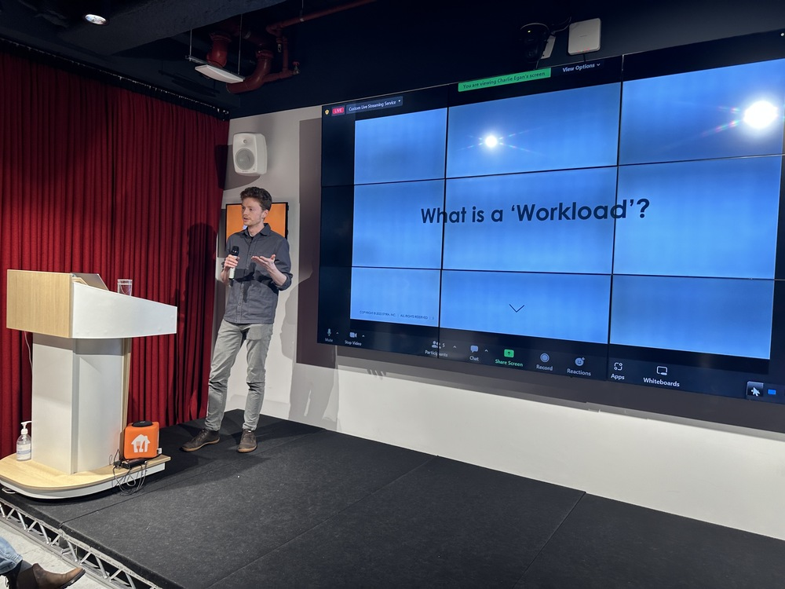

* **I presented at CN London on OPA and SPIFFE**. I've been wanting to do [this talk](/talks/opa-spiffe/) for a while and am happy to have had the chance to do so at a smaller friendly event. Going to the pub afterwards was fun too, and not something I've done with meet up folk since before the pandemic.
  
* **Got some OPA work merged - in time for the 0.50.0 release.** I've been working on [#5576](https://github.com/open-policy-agent/opa/pull/5576) to make it possible to extract Rego AST location data since January, it's our hope that this can support some interesting Rego tooling (stay tuned!). I also merged [#5742](https://github.com/open-policy-agent/opa/pull/5742), which makes it possible to authenticate with OPA using a SPIFFE mTLS connection and use the SPIFFE ID in a `system.authz` policy.
* **Algolia's [DocSearch](https://docsearch.algolia.com) product is confusing**. The main issue I had this week was that the [meta tags](https://docsearch.algolia.com/docs/required-configuration/#introduce-global-information-as-meta-tags) used to label pages didn't appear to configure the search 'facet filters' on that same page. I see Algolia DocSearch everywhere but feel in most cases something like [Stork](https://stork-search.net) or [lunr.js](https://lunrjs.com) which I use on charlieegan3.com would be just fine. Having a separate crawling process also makes changes one step removed - don't under estimate the value of being able to test docs changes locally.
* **I'm back on the [TrainerRoading](https://www.trainerroad.com) before work.** I've been pretty out of touch with my bike since July last year but with the [Highland Cross](http://www.highlandcross.co.uk) now looming again it's time to change that. This will be my 10th 'crossing' and so I'm keen to make it a good one!
* **Threatened for a loaf of bread.** I had the sad and unsettling experience of being threatened near my home for a loaf of bread I was carrying. I gave up the bread and went on my way. Having read a [UKPersonalFinance thread](https://www.reddit.com/r/UKPersonalFinance/comments/11nmyyz/bank_and_phone_lessons_learned_after_a_robbery/) that same morning got me wondering about my 'posture' for a worse case scenario interaction.