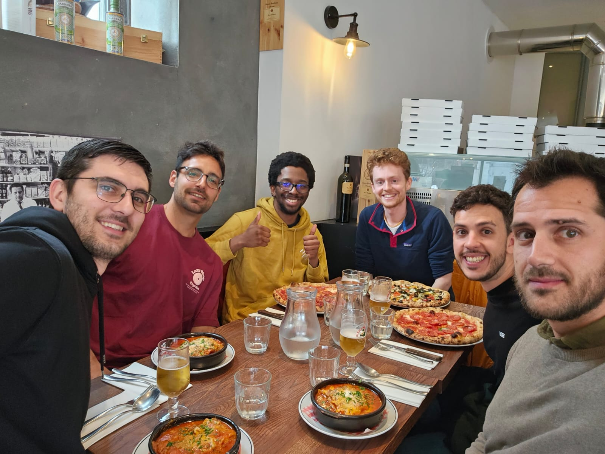

* **Visitors from afar!** Following a busy week of running in and out of central London I felt immensely fortunate to share a lovely meal with my old team (with some new additions!) at one of my favorite [local restaurants](https://www.eatcitro.com). I was relieved to hear that my custom slack emojis were successfully migrated to the new slack workspace 😊
  
  Not pictured but equally enjoyable was a rainy trip to [Kings Cross](https://www.redemptionroasters.com) for some cert-manager, trust domain and SPIFFE chat. It's amazing what you can fit into a part time Friday!
* **Entity Tagging: Continued.** I've been working (intermittently) on a means to [reuse downloaded bundles](https://github.com/open-policy-agent/opa/pull/5687) in OPA for about a month. I had the sketchy idea of stashing the ETag in a [gzip header comment](https://cs.opensource.google/go/go/+/refs/tags/go1.20.2:src/compress/gzip/gunzip.go;l=53), but after some pub chat am now narrowing in on something less magic.
* **Scan as you shop disappointment.** There's this idea that you can carefully pack your shopping while you shop by scanning it yourself. However, 100% of the times I've done this I've been selected for a 'rescan' which removes 100% of the benefit.
* **Mess.** Parkrun this week took place on a very muddy Hampstead Heath. Thankfully the rain had mostly stopped when we started running.
  