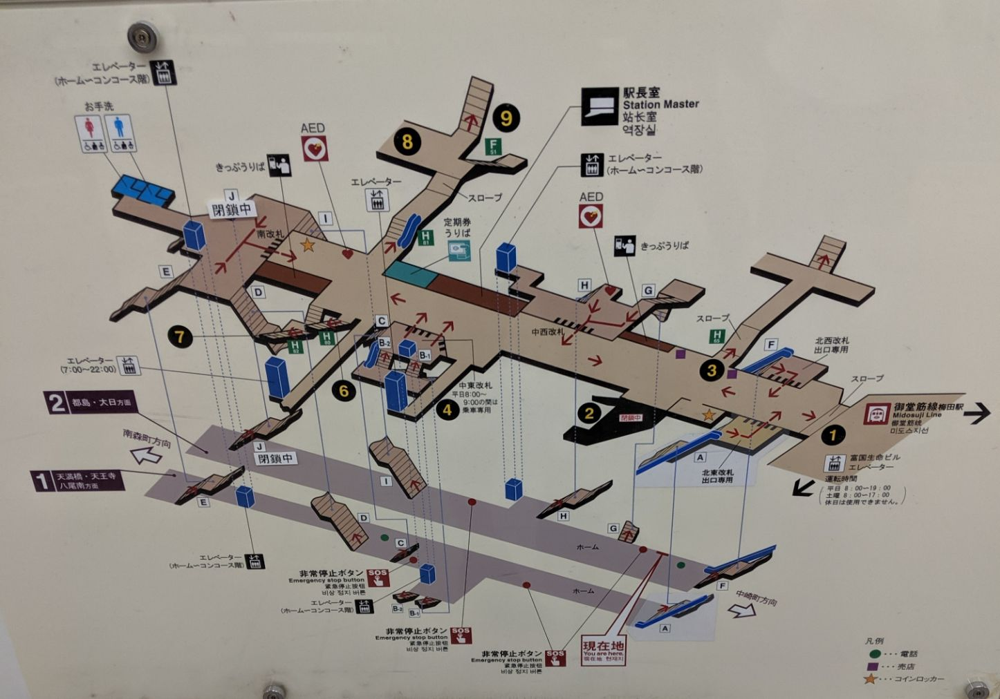
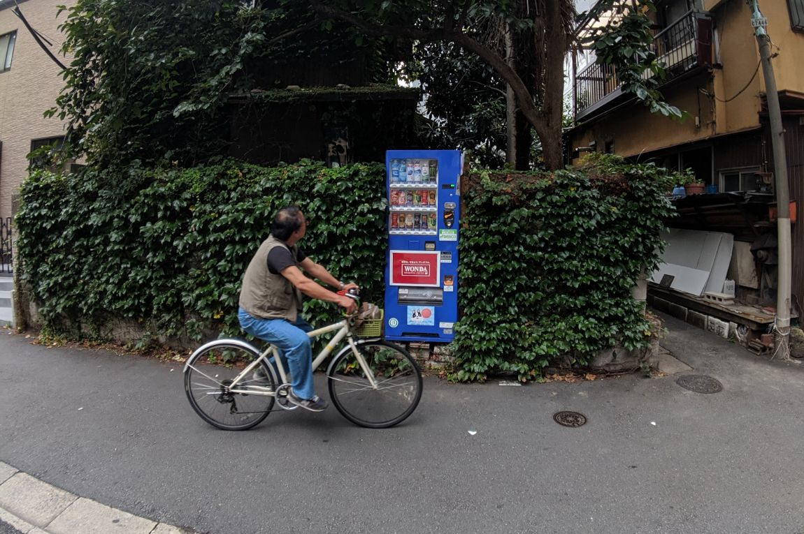
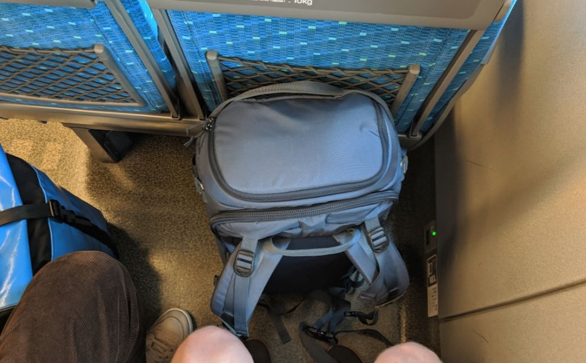
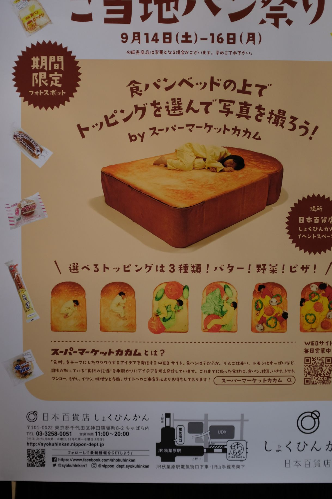
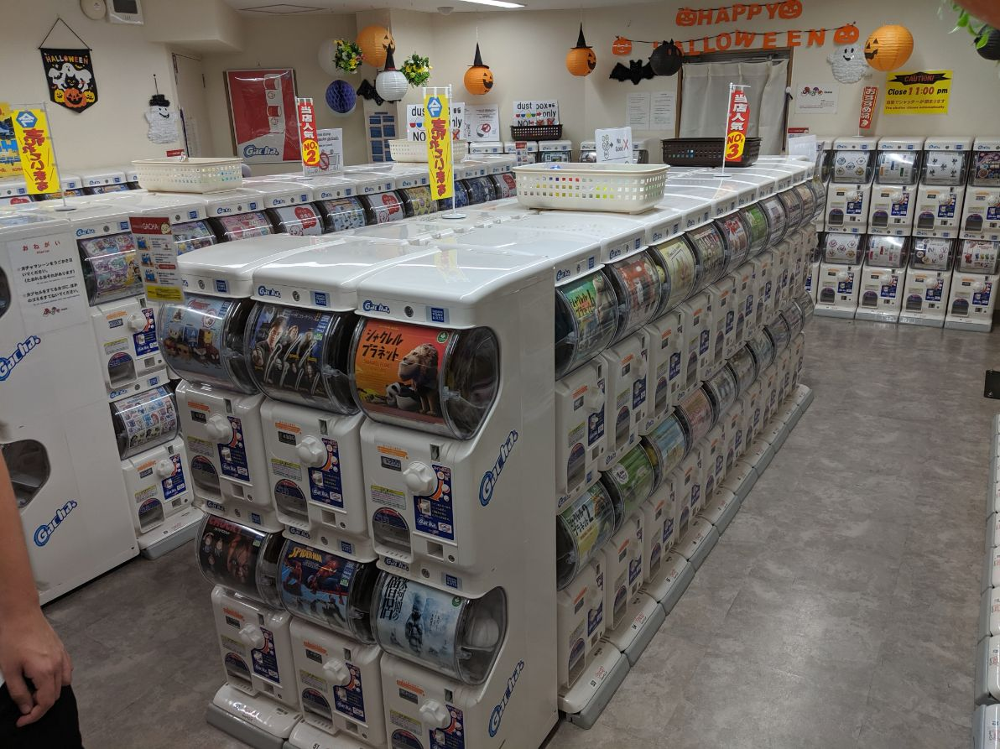

I went to Japan last month. As we walked around I found myself enjoying the
little differences more than anything else. Since returning, I've found myself
talking about them a lot and thought it'd make for quite a good alternative
write up of the trip.

<!-- more -->

(if you're interested in seeing some selected pictures, you can find them on my
[photos site](https://photos.charlieegan3.com/archive/month/2019-09))

## The doors on the left side will open

We made pretty good use of the metro in both Tokyo and Osaka in quite a short
space of time. The summary here is that it's an amazingly easy set of
interconnected systems that runs like clockwork, as expected. Some features I
particularly liked...

- Ticket gates are open when you arrive. Scanning the IC card is instant and the
  barriers don't need to close if you have enough money. The barriers only close
  if there is a problem. This makes moving a crowd through a set of gates much
  faster than in London where gates sometimes take longer to open than others
  and require you to stop walking.
- Some older trains have a special design of seat that can be flipped to make a
  reasonably comfy seat for both directions of the route or to make a group of
  facing seats. There's a [video
  here](https://www.youtube.com/watch?v=DxDrPeb2mxs) of a similar more modern
  design in Sydney.
- The TFL map is famous for being easy to use, however one thing I'd love to
  help with is navigating complex underground stations such as Bank or Green
  Park. I think the main problem is that it's hard to picture of the tunnels
  connect in 3D space.

  This is something many stations we used while in Japan sorted. These station
  maps really are a work of art.

  

- For quite a long time before the doors are about to close a nice little
  jingley tune plays.
- There is excellent signage on the platforms to explain how to get on and off
  the train. In London we are still very bad at this deceptively simple task.

  
  _this is where you stand for this door_

  
  _this is how you choose where to wait based on the destination stop_

- There is amazing support for wheelchair users. We saw two station staff arrive
  30s before the train arrived, stand at exact spot for the correct door,
  and prepare a ramp. When the train arrived the wheelchair user was there ready
  and the staff helped them off the train without any delay to the train. TFL is
  getting better but this simple system was amazingly effective too.
- In Osaka, many of the subway cars had holding handles at three different
  heights for different heights of passenger.
- Something that was confusing for us was that some trains turn into trains fro
  other lines when they get to a central station, and you can just remain on the
  train.
- Dot matrix indicators have better resolution, colors, etc. We just have
  orange...

## Was there a peach fanta in that one?

While playing real life pokemon to collect our favorite soft drinks we covered
quite a lot of ground on foot too.

_vending machine in the middle of a residential area with very few people
around_

Random street-based observations follow...

- Some busy streets have directional pavement lanes - sadly they didn't seem to
  be very effective.
- Public spaces generally have much greater availability of seating.
- Some areas have amazing painted manhole covers. Like this one near the instant
  ramen museum in Osaka.

  

- Using horns in cars seems to be much less common. Streets are generally quiet
  in comparison.
- It's frowned upon to use your phone while walking along. People do it but it's
  far less common. I found myself trying to stop and use my phone instead.
- In Osaka, it seems one can cycle anywhere, pavement, road, crowded shopping
  centre. Watch out for them but they're probably already watching out for you.
- There are chair lifts in some public spaces to help with steps. This isn't
  very common but we I did notice this in a few different places. I wonder if
  this would be possible without vandalism here...

## Shinkansen

_waiting for the train experience of my life - refreshing drink in hand_

- Each row of train seats lines up with a window. oh. my. gawd. Sure, we have
  bigger windows but our trains still feel more claustrophobic and dark. I love
  looking out the window while travelling so this was a win for me.
- We might have missed something but it seems there's a set rate for the trains
  for each route. We paid about £120 to go from Tokyo to Osaka and it didn't
  seem to make any difference how far we looked ahead. This is the dream.
- Shinkansen drivers dress like pilots - seems appropriate for a train who's
  ancestry is based largely on aeroplane design.
- All coaches are quiet coaches. If you want to make a call then you can just
  walk to the vestibule area. People play by the rules too.
- Arrow displays light up to say which side to alight while the train approaches
  the platform. There is also an announcement when the stop will not last long
  and encourages people to prepare to exit around 10 mins before the train
  stops. We stopped for just over 2 mins in Nagoya.
- Passengers leaving train take rubbish and bin it on platform. This matches
  the general rule of taking rubbish home with you. I really respect this and
  think is it coming in some more rural public spaces in Scotland.
- Shinkansen trains have numbers like flights. This number is printed on your
  ticket. While it's a small touch, it makes it easy to know you're on exactly
  the right train.

_look at all that space for my knobbly knees!_

## Please feel free to use a toilet
I'm not sure what the rest of us were doing while the Japanese were designing
their toilets but we got a long way behind - again. Many have heated seats and
some even play music.

  

Relative to my experience of finding public toilets in the UK, public toilets in
Japan are _everywhere_. They are mostly very clean and well looked after if not
modern. Foam soap (to reduce the amount of waste) is much more common, while
hand dryers are much less so. I noticed (after some time) that many carry a
small hand towel with them - this is something I've taken to doing when I
remember too so I don't need to use hand dryers (I hate hand dryers but that's
another post...).

  

In the UK there are 'public' toilets in places like pret. However, they're
usually disgusting and locked unless you buy something and get the code on the
receipt. In Japan, having a toilet was something to bring people in. Feel free,
don't mind if I do!

  

## Would it be OK to have the bill so we can start waiting for the card machine?

In Japan they don't seem to have that dance at the end of the meal out. When you
are ready to do you just walk up, pay, and leave. I appreciated that. Bells on
tables were also a great idea.

Eating while walking around was also not a thing - we learned that people just
think you're strange if you do. To help with this, even in little corner shops
(Family Mart etc) they often have a small table areas and even a sink to wash
your hands with after eating (things purchased in their shop).

Some things didn't make much sense to me though... like these pre-fried chips...

or this bum

this salad

this small butter child advert

## Is that it?

Nope, I'm going back but not sure when.

Some more photos that didn't really fit above...

_vending machine selling handmade bags_

_an unattended gacha shop that locked automatically at 11pm_

_machine to cover umbreallas in a plastic bag to stop drips_
