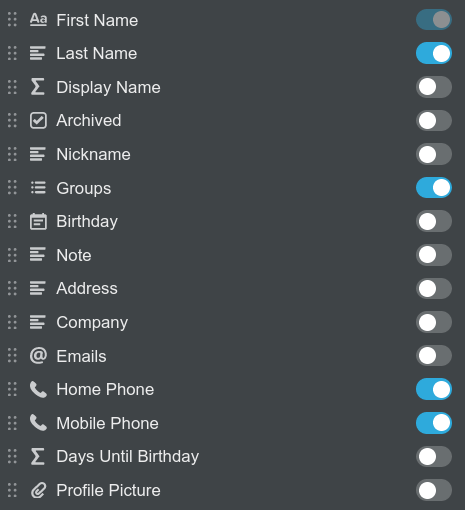

Earlier this week I found myself migrating my contact list to Notion. I decided
to do this because I was lacking the following features in Outlook to
effectively manage my contacts:

- Syncing delays and inconsistencies with Exchange for contacts
- Not being able to have nicknames work in the way that I want (e.g. only on my
phone / WhatsApp)
- A means of archiving contacts, without deleting them
- ...and the straw that broke the camels back: being able to store birthdays and
have a birthday calendar (this is something that is meant to be supported but
it just doesn't work at all)

I've had a lot of fun in putting Notion to work for me over the last 6 months
and thought it was worth a shot for this too. A few years ago I was set on
self-hosting things, now I think I'm more interested in trying to make sure that
there are paths between my cloud accounts for my data and that the data works
for me as I need it to. I think this is a good example of that 'philosophy'.

## What counted as minimum and viable?

The requirements were pretty simple. I need to have a contact list in Notion
that tracked birthdays, supported nicknames and archiving. This needed to be
simple to sync to my phone - even if it were to be a manual task (I don't update
my contacts much and can still update in Notion from anywhere).

I decided to use iCloud to get the contacts to my phone. On
[iCloud.com](http://icloud.com/) it's possible to upload a vcard with many
contacts. It's also possible to delete all your contacts easily when uploading a
new list (not possible on Outlook). If I ever find myself in the situation where
I have an Android phone again I'll find some way to go via Google or similar.

The other nice thing about iCloud and vcards is that they support base64 encoded
JPEGs for profile pictures. This means I can manage pictures in Notion too and
format when syncing.

## From Notion, to disk, to iCloud - with the help of some Ruby

While I was happy for the process to be manually run, I wanted to automate what
was easy. This is what I ended up with.

I have a database in Notion that I can export (with subpages to get pictures)


The table has the following properties:



The computed fields are included in the export. `Display Name` is set to the
nickname if present and otherwise both First and Last names. This is the value
that I want to use in the contacts app on my phone.

```ruby
if(
  prop("Nickname") != "",
  prop("Nickname"),
  concat(prop("First Name"), " ", prop("Last Name"))
)
```

`Days Until Birthday` is set by the following Notion formula and is used to sort
on a different birthday view of the data.

```ruby
dateBetween(
  dateAdd(
    prop("Birthday"),
    dateBetween(
      now(),
      prop("Birthday"),
      "years"
    ) + 1,
    "years"
  ),
  now(),
  "days"
)
```

With the data in this format, it was relatively simple to write a script that converted the exported Notion data (CSV and image files) into a single vcard file.

```ruby
#!/usr/bin/env ruby

require "csv"
require "base64"
require "rmagick"
require "vcardigan"

input = Dir.glob("Index*.csv")
fail "uncertain input, expected single CSV file" if input.size != 1
table = CSV.parse(File.read(input[0]), headers: true)

vcards = []
table.each do |c|
  # if the contact has been archived, skip during export
  next if c["Archived"] == "Yes"

  name = c["Display Name"]

  vcard = VCardigan.create
  vcard.name(*name.split(" ").reverse)
  vcard.fullname name

  # I don't really use 'work' and 'home' emails much, so I just
  # have a plain email for each and store them as a single field
  c["Emails"].to_s.split("\n").map(&:chomp).each do |email|
    vcard.email email
  end

  unless c["Home Phone"].nil?
    vcard['item0'].add('tel', c["Home Phone"])
    vcard['item0'].add('x-ablabel', 'Home')
  end

  unless c["Mobile Phone"].nil?
    vcard['item1'].add('tel', c["Mobile Phone"])
    vcard['item1'].add('x-ablabel', 'Mobile')
  end

  unless c["Note"].nil?
    vcard.note = c["Note"].gsub("\n", '\n')
  end

  unless c["Company"].nil?
    vcard.org = c["Company"].to_s
  end

  # pictures need to be quite small, if they're too large icloud
  # will fail to import that contact.
  unless c["Profile Picture"].nil?
    path = c["Profile Picture"].gsub("%20", " ")
    image = Magick::Image.read(path).first
    image.change_geometry!("200x200") { |cols, rows, img|
        newimg = img.resize(cols, rows)
        newimg.write(path + ".small")
    }
    b64 = Base64.strict_encode64(File.read(path + ".small"))
    vcard.photo b64, :encoding => "b", :type => "JPEG"
  end

  vcards << vcard.to_s
end

# contacts.vcard is the file to upload to icloud
File.write("contacts.vcard", vcards.join)
puts "done"
```

Once that's run, I open [iCloud.com](http://icloud.com/), delete all the contacts
(ctrl+A, delete) and upload the file. It's a very quick process and they're on
my phone instantly.

## What was this all about really and why did you write a post about it?

It's not the most exciting topic but it's something that's made me happy this
week. I feel like scratched an itch and it paid off with minimal effort. I think
I spent longer writing this post than the script.
